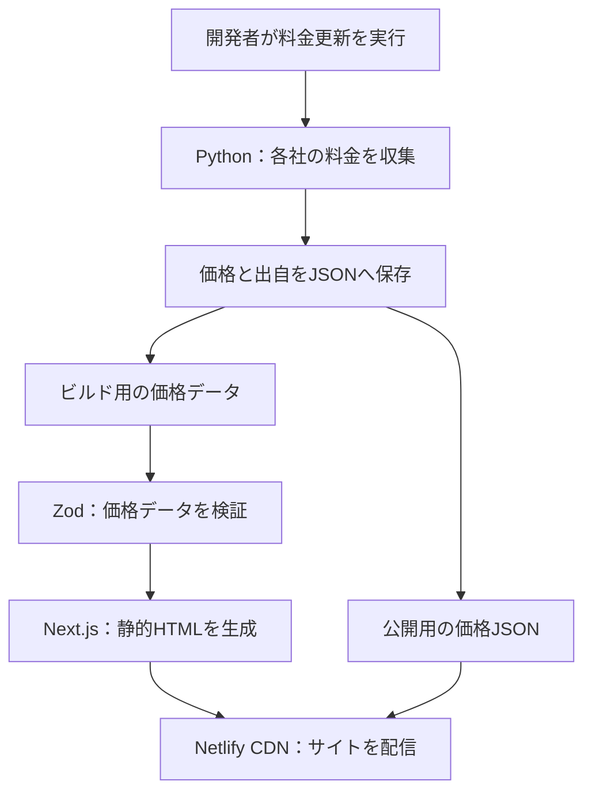
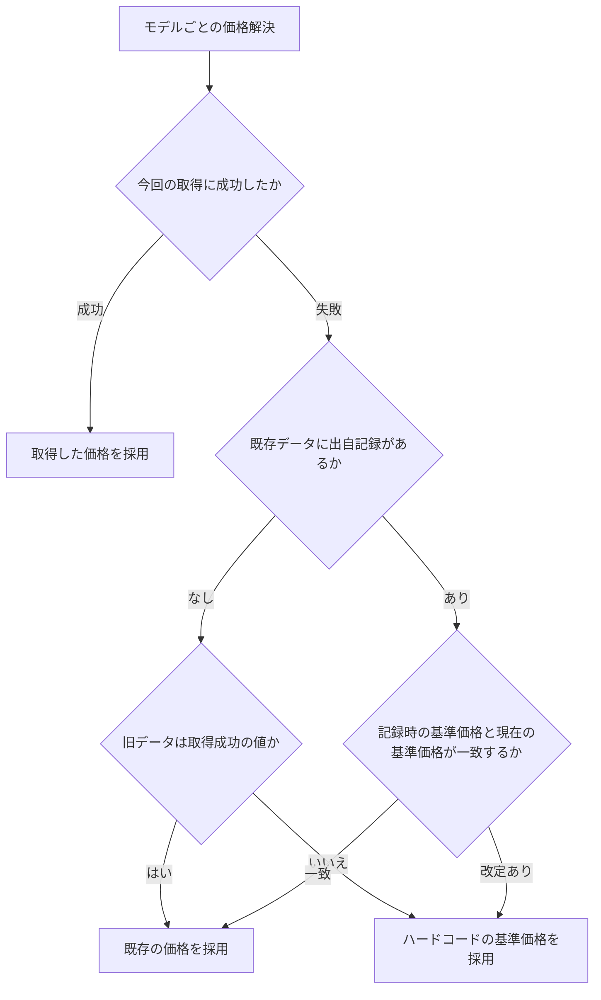
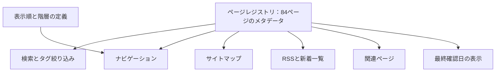

## 1つのリポジトリ、2つのプロダクト

各社のAI API・サブスクリプションの想定費用を比較するコスト計算機と、AIツールの導入・運用を学べるガイド群を、一つの静的Webサイトとして提供します。料金を見積もった後、そのツールの設定や使い方を同じサイトで調べられます。

| 利用したいこと | アプリでできること |
| --- | --- |
| APIの利用費用を見積もる | モデルの入力・出力単価とトークン数、利用時間を組み合わせ、USD・JPYで比較する |
| サブスクツールの費用を比べる | 月額・年額を選択期間に応じて計算し、API費用と同じ比較画面で確認する |
| AIツールを導入・運用する | Claude Code、OpenAI Codex、GitHub Copilot、Gemini、Antigravityなどのガイドを読む |
| 必要なガイドを探す | タイトル・要約・タグを検索し、条件をURLで共有する |
| 更新を追いかける | What's New、RSS、最終確認日の表示から新着・更新情報を知る |

### 利用量と期間を変えながら料金を比較する

コスト計算機ではAPIモデルやサブスクツールを選び、入力・出力トークン数と利用時間を指定します。期間プリセットは1時間、8時間、24時間、7日、30日、4か月、12か月の7段階です。価格データと入力条件を組み合わせ、その場で比較表を更新します。

API費用の計算式は「（入力トークン数 ÷ 100万 × 入力単価 ＋ 出力トークン数 ÷ 100万 × 出力単価）× 利用時間」です。入力するトークン量と時間の組み合わせが計算結果を決め、計算処理の内部では丸めません。

| 計算・表示 | 具体的な振る舞い |
| --- | --- |
| API従量課金 | 入力・出力の単価はUSD / 100万トークン。両方の費用を加算して利用時間を掛ける |
| サブスクリプション | 月額を720時間基準で時間按分。8,760時間以上では年額をそのまま採用する |
| USD表示 | 有限の正数が0.005ドル未満なら「<$0.01」。それ以外の正数は小数第2位まで表示する |
| JPY表示 | 為替レートで換算し、0円超・1円未満は「<¥1」。1円以上は四捨五入して桁区切りする |
| 無効な値 | USDの非有限値・0以下は「$0.00」。JPYでは金額や為替レートが無効なら「¥—」と表示する |

### 84ページのガイドから目的の情報へ進む

資料の2026年9月18日時点では84のガイドページを持ちます。横断検索はタイトル・要約・タグの部分一致で行い、検索語はURLの?q=、タグ条件は?tag=で共有できます。関連ページは共通タグ数などに基づいて決定し、記事の最終確認日も表示します。

日本語・英語のテキストを管理する基盤がありますが、資料時点のガイド本文は日本語固定です。ガイド数や料金情報は、資料の調査時点の内容として紹介しています。

## 料金更新とサイト配信を分ける

Pythonスクレイパーが各社の料金ページを取得し、価格と採用した値の出自をJSONへ保存します。開発者が更新処理を明示的に実行して生成データを保存し、Next.jsはそのデータを読み込んで静的HTMLを生成します。Netlifyのデプロイ中にスクレイピングは実行しません。

### 価格を更新して静的サイトへ届ける

### 取得に失敗しても値の出自を判断する

価格は今回の取得値、過去に採用した値、ハードコードの基準値を突き合わせて解決します。取得失敗時に無条件で過去の値を使い続けるのではなく、基準価格の改定も確認します。

この仕組みで表示を維持できても、価格の鮮度は更新作業に依存します。Google AI / Vertexの価格は料金ページの構造が不安定なため、資料時点ではライブ取得を行わず基準価格を採用する設計です。

### ガイド情報を一度定義して横断機能へ使う

ページごとのタイトル・要約・タグ・更新日をレジストリへまとめ、ナビゲーション、検索、RSS、サイトマップ、関連ページへ供給します。表示順とナビゲーションの階層だけは別の分類定義で管理します。

## データの契約と静的配信の構成

スクレイパーとWebを別の実行環境で保守しながら、価格データの型とガイドのメタデータを共通の契約として扱います。Pythonで生成した価格JSONは、Web側で検証してから計算画面へ渡します。

| 技術 | このアプリでの責務 |
| --- | --- |
| Next.js 16 / React 19 / TypeScript | 計算画面とガイドをApp Routerで構成し、静的エクスポートする |
| Tailwind CSS v4 / CSS Modules | 共通の画面スタイルとページ固有のレイアウト |
| Python 3.12以降 / uv | プロバイダー・ツールごとの料金収集処理を実行する |
| httpx / Playwright | HTTP取得とブラウザを使うスクレイピング |
| Pydantic / Zod | Python側の価格モデルとWeb側のJSON検証 |
| Mermaid | 導入ガイド内の構成・処理を図解する |
| Vitest / pytest / Biome | 計算、収集処理、ページ構成、静的解析を検査する |
| Netlify | ビルド済みHTMLと価格JSONをCDNで配信する |

価格の型はPythonのPydanticモデルを基準とし、TypeScript側の定義と同期します。両者の型の一致、ページの登録漏れ、レジストリとナビゲーションの対応を機械的に検査します。

サイト配信と料金収集を分けるため、閲覧時に外部の料金ページを取得する必要はありません。価格を更新するには、収集・保存・サイト再生成の作業が必要です。

## 記録されたテスト結果と運用上の課題

以下は基準資料が記録した**2026年9月18日時点**の検証結果です。この詳細画面でアプリ本体のテストを再実行した結果ではありません。

| 対象 | 資料で確認された結果・境界 |
| --- | --- |
| フロントエンド | Vitest：177ファイル、1,639テストが成功 |
| スクレイパー | pytest：5ファイル、100テストが成功 |
| ページ情報 | 登録漏れ、存在しない参照、ナビゲーションとの対応をテストで検査 |
| 型の同期 | PydanticとTypeScriptの型定義の一致をコンパイル時に検査 |
| CI | フロント・バックのテストを実行。型検査・Lint・build・E2EはCIに含まれない |

| 継続課題 | 具体的な内容 |
| --- | --- |
| 価格取得の成功率 | ネットワークと各社料金ページのHTML変更に依存する |
| 価格の鮮度 | フォールバック値や過去値を採用する場合があり、常に最新価格とは限らない |
| E2E | CI未組込。一部が現行DOMに存在しない要素IDを参照しており、実装との不整合がある |
| 自動品質ゲート | 型検査・Lint・buildはローカル運用に委ねられている |
| SonarQube Cloud | トークンなど初回セットアップが必要 |

## 説明の基準と対象時点

このページは、料金計算機とAIツール導入ガイドの機能、価格更新の流れ、データの契約を対応ドキュメントから整理しています。

| 項目 | 基準 |
| --- | --- |
| 基準資料 | docs/PROJECT-DETAILS/PROJECT_DETAILS-LLM-Studies.md |
| 資料更新日・テスト測定日 | 2026年9月18日 |
| 画面の更新日 | 2026年10月2日 |
