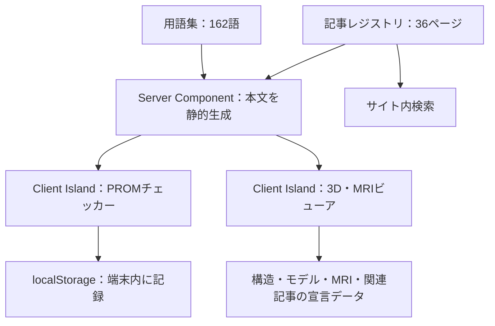
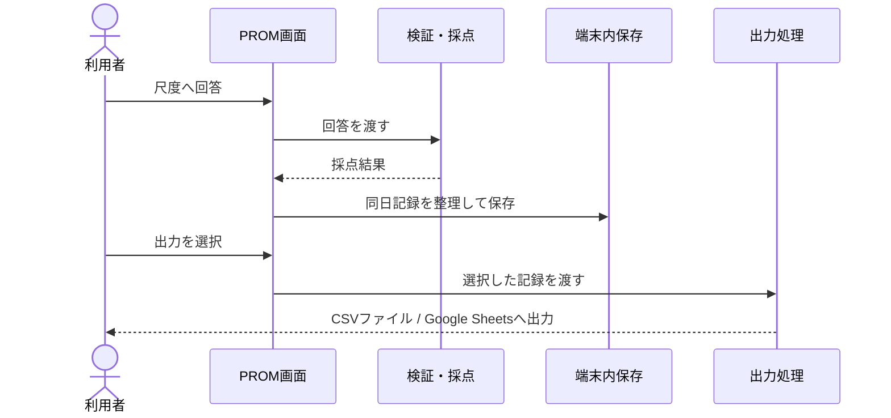
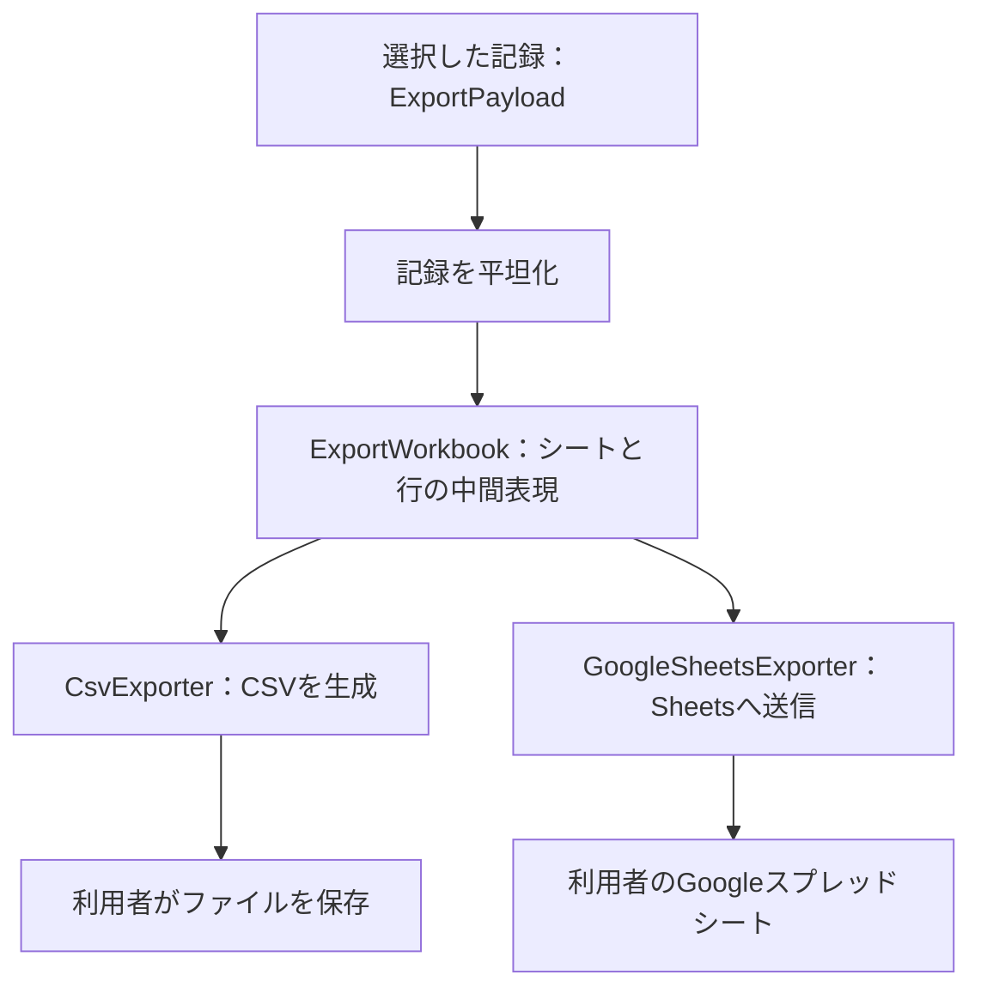

## 学ぶ・理解する・記録するを、1つのWebアプリへ

頭痛の教育記事、3D解剖アトラス、患者報告アウトカム（PROM）の自己記録を統合したWebアプリです。医学生・研修医が頭痛に関連する構造や治療の考え方を学び、患者が日誌や尺度の回答を端末内へ記録できるように構成しています。資料で定める用途は教育と自己記録です。

| 利用者・目的 | 提供する機能 |
| --- | --- |
| 医学生・研修医の学習 | ICHD-3に基づく頭痛記事、神経ブロック、薬物・非薬物治療、3D解剖とMRIスライス |
| 患者の理解と記録 | 平易な用語説明、PROMチェッカー、頭痛日誌、記録のCSV・Google Sheets出力 |
| コンテンツの保守 | 記事レジストリ、検索、ライセンス・セキュリティ・プライバシーの公開基準 |

### 教育記事を検索し、専門用語を確認する

資料の2026年9月18日時点では、36ページをコンテンツレジストリに登録しています。頭痛疾患5ページ、神経ブロック4ページ、治療7ページ、非薬物療法7ページ、PROM解説6ページに加え、解剖アトラスのトップと6つのサブページを持ちます。

| コンテンツ | 具体的に扱う内容 |
| --- | --- |
| 頭痛疾患 | 片頭痛、緊張型頭痛、頸原性頭痛、薬物乱用頭痛、病態生理 |
| 神経ブロック | 後頭神経ブロックなどの解剖学的根拠と手技を学ぶ教材 |
| 治療ガイド | 急性期・予防治療、CGRP標的薬、薬物乱用頭痛の予防、トリガーの同定 |
| 非薬物療法 | 理学療法、有酸素運動、栄養・サプリメント、心理行動療法、睡眠指導など |
| PROM解説 | 尺度の目的、採点方法、解釈を学ぶ静的記事 |
| 解剖アトラス | 宣言データに基づく3Dモデル、注釈、MRIスライス、関連教材への導線 |

ヘッダーの検索は登録された記事を横断します。162語の用語集は、本文中で最初に出現した専門用語へ読み仮名と平易な言い換えを付け、ツールチップで表示します。

### 3DとMRIから頭頸部の構造を理解する

アトラスは構造ごとのモデル・MRI画像・関連教材を宣言データで管理します。モデルは必要時に読み込み、注釈や検索、サイドナビから構造を探せます。MRIのPNGスライスはビューアで切り替えて確認します。資料時点ではコードが実装済みで、実glTF資産の投入と性能測定は継続課題です。

### 日誌と尺度を端末内へ記録する

PROM統合チェッカーはHIT-6、MIDAS、MSQ v2.1、PGIC、NRS/VAS、頭痛日誌を扱います。回答を検証・採点して記録し、同日の重複を整理してlocalStorageへ保存します。SNOOP4は点数を算出せず、危険徴候を確認するゲートとして扱います。

HIT-6とMSQの設問本文は権利者の著作物のため公開データに含めません。ローカル用の任意オーバーレイは本番で読み込まず、件数が合わない場合もプレースホルダに戻します。

## 静的な本文と対話機能の境界

教育記事はServer Componentで静的プリレンダし、PROM、3D、MRI、Mermaidの機能はClient Componentへ分けます。重量ライブラリはマウント時に遅延ロードし、読み込みに失敗しても記事本文を読める構成です。

### 回答を記録し、選択した出力先へ渡す

採点処理、保存処理、エクスポート処理は別の責務として扱います。通常の記録はブラウザ内に保持し、利用者が出力を選んだ場合にCSVを生成するか、選択したデータをGoogle Sheets APIへ送ります。

### フォーマットに依存しない中間データを作る

エクスポートは記録をまとめる入力データ、行・シートからなる中間表現、実際に書き出す処理の三層に分けます。Google SheetsのOAuthトークンはメモリ内だけで保持し、drive.fileの最小スコープを利用する設計です。

## 公開範囲・保存・ライセンスの制約

資料では教育専用・診断補助なしを方針として定め、患者固有の3D再構築、DICOM読み込み、AI診断、用量計算を対象外にしています。機能の公開範囲とデータの扱いを分けて管理します。

| 技術・境界 | このアプリでの役割・制約 |
| --- | --- |
| Next.js 16 / React 19 / TypeScript | 記事と対話機能をApp Routerへ統合。資料時点で40ルート（記事36＋管理外の静的ルート4） |
| Tailwind CSS v4 / scoped CSS | 教育記事と記録画面の共通デザイン |
| model-viewer / glTF | 3Dモデルの遅延ロードと注釈表示 |
| localStorage / StorageAdapter | 記録を端末内へ保存し、保存先を採点処理から切り離す |
| CSV / Google Sheets API | 利用者が選んだ記録を出力する。Googleへの出力ではデータ送信が発生する |
| 制限尺度 | HIT-6・MSQの設問を公開しない。本番のオーバーレイ読み込みを禁止する |
| 3D資産のライセンス | BodyParts3D由来の資産はCC-BY-SA 2.1 JPとして、MITのコードと別の範囲で管理する |
| セキュリティヘッダー | CSPなどを静的生成。inline script許容は資料に受入済み残余リスクとして記録されている |
| 教材の管理 | 旧Markdown / HTML原稿の基準が未決定で、一部の新規執筆計画が停止している |

プライバシー・利用規約ページは実装済みですが、資料では法務レビュー待ちの暫定文言としています。用途や法的な位置付けの記述は、プロジェクトが定めた公開方針として紹介しています。

## 記録された品質と未検証の範囲

以下は基準資料が記録した**2026年9月18日時点**の結果です。教材内容や外部サービスの現在の状態を保証するものではありません。

| 検証 | 資料で確認された結果・対象 |
| --- | --- |
| Vitest | 79ファイル、837テストが成功 |
| 型検査・Lint | 同時点で成功 |
| レジストリの整合性 | 登録36ページと管理外4ルートの合計が実ルート40件に一致 |
| PROM・出力 | 採点などの純粋関数、ページ契約、登録データの対応関係を検査 |
| CI | Webの型検査・Lint・テスト・build、ライセンス、Markdown、Mermaidスクリプト、PIIチェックの5ジョブ |

| 継続課題 | 資料時点の状態 |
| --- | --- |
| 3D資産 | 実glTF資産の投入待ち |
| 性能 | Lighthouse実測が未着手 |
| Google Sheets | 実機確認の記述に資料間の粒度差があり、検証範囲の確認が必要 |
| 視覚回帰 | 3D・MRI・UIの表示確認は手動に依存 |
| コンテンツ拡張 | 旧原稿の管理方針が未決定 |
| 公開文言 | プライバシー・利用規約は専門家レビュー待ち |

## 説明の基準と対象時点

このページは、教育記事・解剖アトラス・自己記録の使い方と、データ保存・公開範囲を対応ドキュメントから整理しています。

| 項目 | 基準 |
| --- | --- |
| 基準資料 | docs/PROJECT-DETAILS/project-overview-medical-studies.md |
| 資料作成日・テスト測定日 | 2026年9月18日 |
| 画面の更新日 | 2026年10月2日 |
