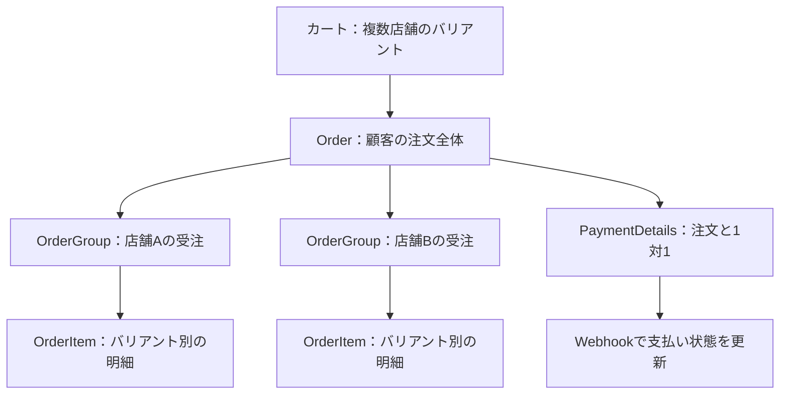
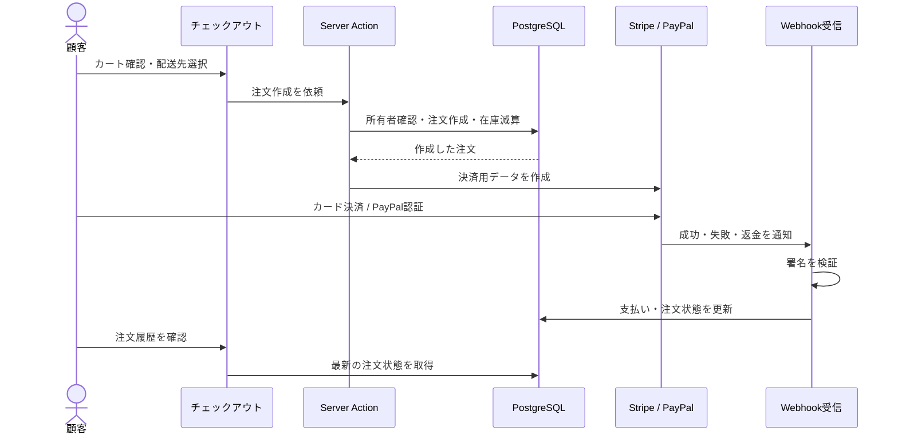
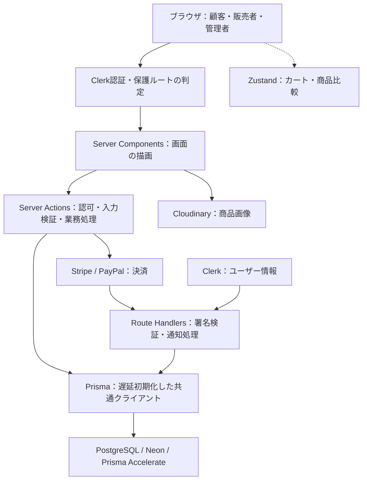

## 顧客・販売者・管理者を、1つの市場でつなぐ

複数の独立した販売者が出品し、顧客が店舗を横断して商品を検索・購入できるマーケットプレイスです。購入後の注文追跡やレビュー、店舗とのメッセージも同じアプリで扱います。販売者には自店舗の運営画面、管理者にはプラットフォーム全体の管理画面を提供します。

| 利用者 | 操作できること | アプリが提供する価値 |
| --- | --- | --- |
| 顧客（USER） | 商品検索・比較、カート、購入、注文履歴、レビュー、ウィッシュリスト、店舗フォロー、DM | 複数店舗の商品をまとめて探し、購入後も注文と店舗とのやり取りを管理できる |
| 販売者（SELLER） | 店舗作成、商品・バリアント、在庫、注文、クーポン、配送設定、DM | 自分が所有する店舗の商品と受注業務を一つのダッシュボードで扱える |
| 管理者（ADMIN） | カテゴリ、オファータグ、全体クーポン、全注文、店舗、売上統計 | 店舗を横断してカタログを維持し、注文や店舗の状況を把握できる |

### 顧客：商品を見つけて購入し、届くまで確認する

ホームではおすすめ商品や特集カテゴリを表示します。商品一覧はカテゴリ・価格・サイズ・色で絞り込み、並べ替えとページネーションに対応します。検索ではPostgreSQLの全文検索を使い、関連度順で最大50件を返します。商品名・ブランド・バリアントに基づくサジェストも用意しています。

商品詳細ではバリアントごとの情報を表示し、バリアント未指定のURLでは最初のバリアントへ移動します。商品比較はブラウザのlocalStorageへ選択内容を保存します。カートもZustandの永続ストアで追加・数量変更・削除を扱い、国別の送料を計算します。

ログインした顧客はチェックアウトでカートと配送先住所を確認し、StripeまたはPayPalで決済します。未ログインでチェックアウトへアクセスするとカートへ戻ります。プロフィールでは住所、支払い履歴、注文・レビュー履歴、ウィッシュリスト、フォロー中の店舗を管理できます。注文追跡フォームはゲストも利用できます。

### 販売者：商品・在庫・配送を店舗ごとに運営する

所有店舗の一覧から店舗を選び、商品の新規作成やバリアント追加を行います。在庫画面では不足アラート、しきい値設定、インライン編集を提供します。注文一覧、店舗クーポンの作成・更新・削除、デフォルト配送情報や配送料金テーブル、店舗プロフィールも店舗単位で管理します。購入者との会話は店舗のメッセージ画面に集約します。

### 管理者：全店舗を横断して市場を維持する

ダッシュボードには統計カード、売上推移、最近の注文・店舗を表示します。階層カテゴリとオファータグを管理し、全店舗のクーポン・注文・店舗を一覧できます。注文は注文状態や支払い状態で絞り込めます。顧客向けにはFAQ、お問い合わせ、返品交換、紛争申立などのサポート画面も備えています。

## カートから店舗別の注文、決済確定まで

一つのカートに複数店舗の商品が入るため、注文全体と店舗別の受注を分けて保存します。注文作成ではカートと配送先の所有者を確認し、トランザクション内で注文・店舗別グループ・明細を作成して在庫を減算します。

### 注文を店舗単位へ分けるデータ構造

| データ | 具体的な役割 |
| --- | --- |
| Product / ProductVariant | 商品に紐づくバリアントを管理。価格・在庫・画像はバリアント単位で扱う |
| Cart / CartItem | ユーザーに紐づくカートと、店舗・バリアントごとの商品行 |
| Order | 顧客の一回の注文全体。配送先と支払い情報に紐づく |
| OrderGroup | 注文を店舗単位に分け、各販売者の受注管理につなぐ |
| OrderItem | 注文内のバリアント単位の明細と商品状態を持つ |
| PaymentDetails | 注文に対して1件の決済情報を持ち、外部通知から状態を更新する |
| Coupon | 店舗限定（STORE）とプラットフォーム全体（PLATFORM）の適用範囲を持つ |

### 決済画面と支払い状態の更新を分ける

StripeではPaymentIntent、PayPalでは決済用注文を作成します。外部サービスから届く成功・失敗・返金通知は、署名を検証してからアプリの支払い状態へ反映します。注文作成、決済操作、結果の通知はそれぞれ別の段階です。

Stripeの成功・失敗・返金イベントと、PayPalのキャプチャ完了・拒否・返金イベントを処理します。同じ通知が再送されるケースに対する冪等性は、資料で実DBによる検証が記録されています。

## 画面・業務処理・外部サービスの責務

Next.js 16のApp RouterとServer Componentを画面の基盤にし、業務処理をServer Actionsへ集約します。認可ガードで利用者のロールと店舗所有権を確認し、Prismaを通じてPostgreSQLへアクセスします。カートと比較の状態はブラウザ側で管理します。

| 技術・サービス | このアプリでの用途 |
| --- | --- |
| Next.js 16 / React 19 / TypeScript | 顧客画面と販売者・管理者ダッシュボード、Server Actions、Webhookの受信 |
| PostgreSQL / Neon / Prisma / Prisma Accelerate | 店舗・商品・注文の永続化、リレーションとトランザクション |
| Clerk / Svix | 認証・アカウント設定、署名付きWebhookによるユーザー作成・更新・削除の同期 |
| Stripe / PayPal | 二系統の決済作成と、成功・失敗・返金の通知 |
| Cloudinary | 商品画像のホスティングとアップロード |
| Zustand + persist | ブラウザ側のカートと商品比較の永続化 |
| React Hook Form / Zod | フォームの入力管理とバリデーション |
| Tailwind CSS / shadcn/ui | 商品画面・管理画面のUI |
| Jest / Playwright / testcontainers | 単体・コンポーネント、ブラウザE2E、PostgreSQLを使う統合テスト |

## 認可・送料・金額計算を共通化する

販売者の操作ではSELLERロールだけでなく対象店舗の所有権も再検証します。金額計算はDecimal、送料計算は共通処理へ集約し、画面や店舗ごとに異なる計算が生じるのを避ける設計です。

| 境界 | アプリの振る舞い・設計 |
| --- | --- |
| 認証とロール | 未認証、管理者以外、販売者以外の操作を共通ガードで拒否。店舗操作には所有者確認も追加する |
| 保護する画面 | ダッシュボード、チェックアウト、プロフィールを認証ミドルウェアで保護する |
| 認可エラー | ガードを汎用的なtry/catchの外で実行し、認可の失敗理由をDBエラーで上書きしない |
| 配送料 | 国別の配送ルールを扱い、ITEM（個数）・WEIGHT（重量）・FIXED（固定）の計算を共通化する |
| 金額精度 | 金額フィールドをDecimal(12,2)で保持し、集計もPrisma.Decimalで行う |
| DB初期化 | Prismaを初回アクセス時に生成し、開発時は共通クライアントを再利用する |
| DB依存の画面 | force-dynamicを宣言し、CIのビルド中にDBへの接続が必要になることを避ける |
| カテゴリ階層 | 深度上限4の階層を扱う。隣接リストとmaterialized pathから新しいカテゴリ参照へ段階移行中 |
| 検索入力 | PostgreSQL全文検索のクエリをパラメータ化する。カテゴリやページ番号のURL入力も正規化する |

現フェーズの目標は、チェックアウト完了率とカート離脱の改善、販売者の商品・在庫管理の操作性向上、管理者のカタログ維持コスト低減です。多通貨、税計算エンジン、高度な分析ダッシュボード、配送キャリアとの連携は対象外です。

## 資料に記録された検証と継続課題

以下はプロジェクトドキュメントがQA_HANDOFFをもとに記載した**2026年9月4日時点**の結果です。この詳細画面でアプリ本体のテストを再実行した結果ではありません。

| 検証 | 資料に記録された結果・対象 |
| --- | --- |
| Jest 単体・コンポーネント | 2,184 passed / 2,187 total、199スイート |
| Jest 統合 | 136テスト、16スイート。testcontainersのPostgreSQLを直列共有 |
| Playwright E2E | 66件 × Chromium・Firefox・WebKit = 198実行、30ファイル |
| Visual / a11y | Visualは4 spec / 5 test、a11yは7 spec。いずれもChromium限定 |
| 型検査 | 型エラー0件 |
| コードカバレッジ | 2026年9月3日測定：Statements 75.32%、Branches 60.8%、Functions 65.9%、Lines 74.8% |
| 観点別のカバレッジ | 8カテゴリ × 10ドメインのマトリクスで18 / 80セル（23%） |

資料では、決済Webhookの冪等性、カートから注文への在庫減算・オーバーセル防止・クーポン適用のトランザクション整合性、カテゴリツリーの編集不変条件を検証済みとしています。認可テストは対象の14ファイル中9ファイルで認証・ロール・IDORを網羅しています。

| 継続課題 | 具体的な範囲 |
| --- | --- |
| 販売者画面のSSR | CloudinaryアップロードUIでself is not definedが発生する可能性。ログでの指摘で、テスト失敗は未確認 |
| 色コントラスト | チェックアウト、プロフィール、出店登録に未達があり、E2Eで該当ルールを無効化中 |
| クーポンの同時更新 | カート合計の楽観的並行制御が未実装。読み取りと書き込みの間で更新が失われる可能性 |
| セキュリティ検証 | マトリクスは2 / 10。API・画面・店舗・ダッシュボードへの認可テスト展開が未完了 |
| 性能監視 | Performanceは0 / 10。Bundle Sizeの継続監視は未整備、Lighthouseは商品一覧のwarn-only基準 |
| カテゴリ移行 | 旧・新カテゴリ参照が共存し、Phase Cの後続作業が残る |

テスト件数だけで全機能の品質を判断できないため、検証済みの範囲と未着手の観点を併記しています。

## 説明の基準と対象時点

このページは、リポジトリ内の**PROJECT_DOCUMENTATION-Multi-Vendor-E-Commerce.md**を元に、利用者ごとの操作、注文と決済の流れ、技術の責務、制約を整理したものです。

| 項目 | 基準 |
| --- | --- |
| 基準資料 | docs/PROJECT-DETAILS/PROJECT_DOCUMENTATION-Multi-Vendor-E-Commerce.md |
| 資料の調査時点 | 2026年9月18日 |
| テスト統計の時点 | 2026年9月4日（コードカバレッジは9月3日） |
| 画面の更新日 | 2026年10月2日 |

資料内にはServer Actionsの直接importについて相反する記述があります。このページでは、画面・業務処理・データアクセスの責務に沿って説明しています。
