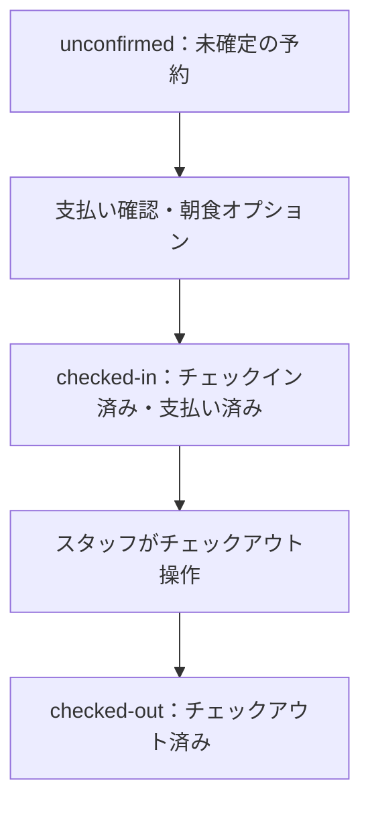
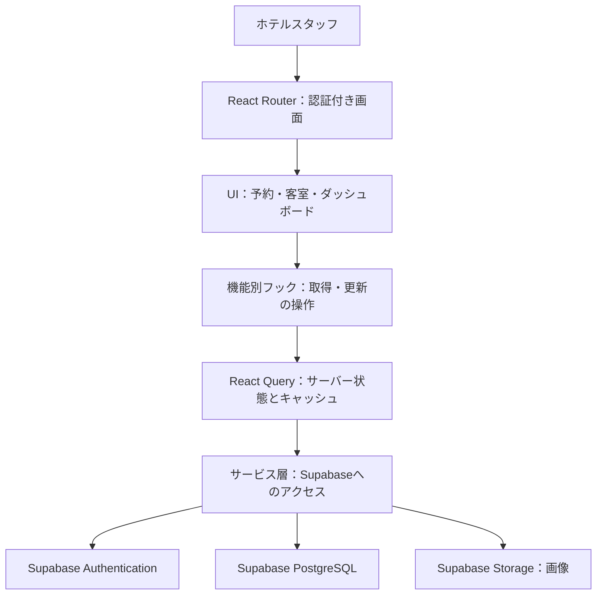
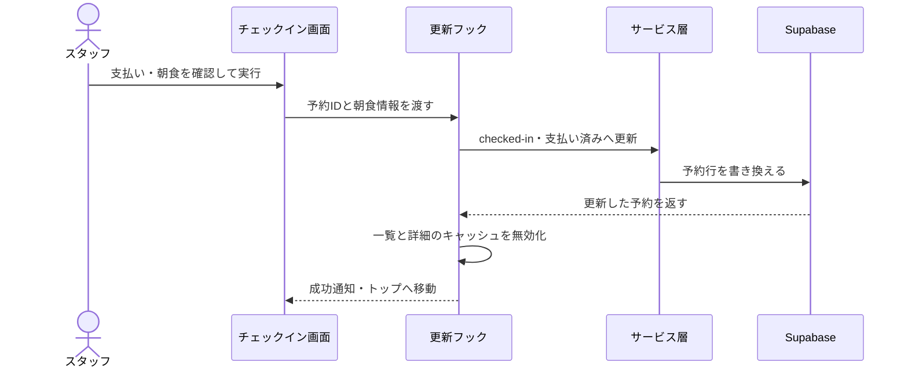

## ホテルの日次業務を、1つの管理画面へ

ホテルの内部スタッフが客室・予約・ゲスト情報を一元管理する業務ダッシュボードです。フロントデスクでのチェックイン・チェックアウト、客室の編集、予約の確認、売上と稼働率の把握を同じアプリで行えます。

Supabase Authenticationへのログインが必要で、新規スタッフの登録は既存スタッフが行います。宿泊客向けの予約サイトや一般公開のサインアップは、このアプリの対象外です。

| 画面・業務 | スタッフができること |
| --- | --- |
| ダッシュボード | 直近7・30・90日の売上、稼働率、滞在日数分布、本日の入退室対象を確認する |
| 客室管理 | 客室を一覧し、作成・編集・削除する。客室画像をアップロードする |
| 予約管理 | 状態で絞り込み、並べ替え・ページネーションで探す。詳細表示や削除を行う |
| チェックイン | 支払いを確認し、朝食オプションを含めて予約をチェックイン済みにする |
| チェックアウト | 滞在中の予約をチェックアウト済みにする |
| ホテル設定 | 朝食価格、最小・最大宿泊日数、最大ゲスト数を更新する |
| スタッフアカウント | ログイン・ログアウト、アカウント作成、表示名・パスワード・アバターの更新 |

### 本日の入退室と期間集計を確認する

ダッシュボードはURLの?last=で期間を指定し、未指定時は7日分を取得します。7・30・90日の切り替えで売上や稼働率、滞在日数の分布を比較できます。本日のチェックイン・チェックアウト対象一覧から、その日のフロントデスク業務へ進めます。

### 予約を探して状態を更新する

予約一覧はフィルタ・ソート・ページネーションに対応します。予約詳細から支払い確認と朝食オプションを扱い、チェックイン成功時は支払い済みとして保存します。予約の状態は未確定、チェックイン済み、チェックアウト済みの3つです。

### 客室情報と画像をまとめて管理する

客室の保存処理は、レコード保存後にSupabase Storageへ画像をアップロードします。新規作成時に画像アップロードが失敗した場合は、作成したレコードの削除を試みます。データと画像が別サービス操作になるため、部分失敗への対処も設けています。

## UI・サーバー状態・Supabaseを分ける

React 19とViteのSPAをフロントエンドにし、認証・データベース・画像保存にはSupabaseを使います。自前のAPIサーバーは持ちません。画面、機能別フック、React Query、サービス処理に役割を分けています。

### チェックイン後に一覧と詳細を再取得する

画面から予約IDと朝食オプションをフックへ渡し、React Queryの更新処理を経由してSupabaseの予約行を書き換えます。成功時は予約一覧と予約詳細のキャッシュを無効化し、更新した状態を再取得できるようにします。

チェックアウトは状態をchecked-outへ更新し、キャッシュを無効化します。資料ではチェックインはトップへ遷移し、チェックアウトは遷移しない振る舞いとして記載されています。

## 認証とデータ更新の構成・制約

画面の認証ガードは認証状態を確認中ならスピナーを表示し、未認証ならログイン画面へ移動します。認証済みの場合に管理画面を描画します。データ側の行レベルアクセス制御（RLS）はSupabase側で管理します。

| 技術・設計 | このアプリでの責務 |
| --- | --- |
| React 19 / Vite / TypeScript strict | 管理画面のSPAと、予約・客室・ゲストの型 |
| React Router | 管理画面への移動と認証ガード |
| TanStack React Query v5 | 取得結果のキャッシュ、更新後の無効化、期間ごとの集計取得 |
| React Hook Form | 客室・設定・アカウントの入力管理 |
| styled-components v6 | 共通UIとテーマ、ダーク・ライトモード |
| Supabase Auth | スタッフのメール・パスワード認証とアカウント管理 |
| Supabase PostgreSQL / Storage | 予約・客室・ゲスト・設定データと、客室画像・アバター |
| Vitest / Testing Library / Playwright | フック・サービス・コンポーネントとブラウザ業務フローの検査 |

| 更新の境界 | 資料で記載された振る舞い・制約 |
| --- | --- |
| ログイン | 成功時にユーザーキャッシュを更新し、ダッシュボードへ移動する。失敗は汎用メッセージで通知する |
| 予約 | チェックインとチェックアウトの更新後に一覧・詳細キャッシュを無効化する |
| ホテル設定 | 単一行の設定を部分更新する。資料時点では取得側と更新側のクエリキーが一致していない |
| キャッシュ鮮度 | staleTimeは原則0として、取得済みデータを常に新鮮と扱わない |
| RLS | Supabase管理画面で設定し、リポジトリ内には定義がない |
| 画像の部分失敗 | 新規客室作成の画像失敗時はレコード削除、アバター更新失敗時は画像削除を試みる |
| 実行環境 | BunとNode.js 22.22.0以降。React Router v8の互換要件に合わせる |

## テストの配置と未検証の境界

以下は**2026年9月18日作成の資料**に記載された調査結果です。テストファイルの存在と対応範囲を示し、現在のテスト成功数や実環境での保証を意味しません。

| 検証 | 資料で確認された構成 |
| --- | --- |
| Vitest / Testing Library | 71件のテストファイル。機能別フック・コンポーネント、サービス、型、汎用フック、ユーティリティを対象にする |
| Playwright | 8本のspec。ナビゲーション、チェックイン、予約、客室、設定、ダッシュボード、アカウント、認証 |
| 型検査 | strict、未使用ローカル変数・引数の検査を有効化 |
| Lint | 警告も失敗として扱う設定 |

| 継続課題 | 具体的な範囲 |
| --- | --- |
| 共通UI | Button、Input、Row、Spinnerなど25コンポーネントに対応する単体テストがない |
| 予約取得サービス | 一覧のフィルタ分岐・ページネーション、期間集計、本日の入退室条件の直接テストが限定的 |
| RLS | 設定がリポジトリ外にあり、資料のコード調査だけではアクセス制御の有効性を確認できない |
| アバターの後片付け | 失敗時の画像削除も失敗すると、Storageに孤立ファイルが残る可能性 |
| ページ番号 | 不正な値を1へ戻す処理はあるが、境界値テストの有無が未確認 |

資料の未検証範囲はファイルとテストの対応関係を調べた結果で、カバレッジ測定による網羅率ではありません。

## 説明の基準と対象時点

このページは、ホテルスタッフの業務、予約の状態遷移、Supabaseとのデータ更新、検証の境界を対応ドキュメントから整理しています。

| 項目 | 基準 |
| --- | --- |
| 基準資料 | docs/PROJECT-DETAILS/technical-documentation-The-Wild-Oasis.md |
| 資料作成日 | 2026年9月18日 |
| 画面の更新日 | 2026年10月2日 |
