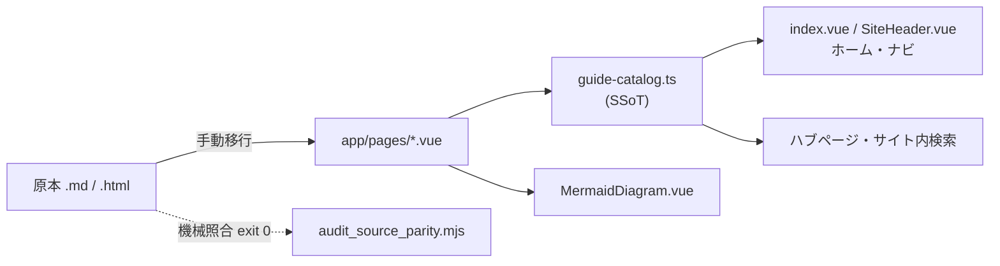

# プロジェクト概要

最終更新日: 2026-09-18

## 00. 概要

- マネジメント/チームビルディング領域の資格・書籍学習ガイドを提供するNuxt製Webサイト
- 1コンテンツにつき原本（`.md`/`.html`）とNuxtページ（`.vue`）を並行管理する
- 対象ユーザーは開発者本人、およびスキル駆動のAIエージェント（Claude Code／Gemini CLI）

## 01. 主な機能

| 機能名 | 概要 |
|---|---|
| ガイドカタログ | 種別→プログラム→シリーズ→ガイドの4階層SSoT。登録がホーム・ナビ・ハブ・検索へ自動反映 |
| ガイドページ | 資格・書籍ごとの学習コンテンツ。TOC連動・Mermaid図付き |
| サイト内検索 | `/`または`Cmd/Ctrl+K`で起動。DOM非依存の純関数による絞り込み |
| Mermaid図解 | 共有コンポーネントによる中央寄せ・縮小フィット描画 |
| 原本照合監査 | 移行時の転写漏れをexit codeで機械検知するゲート |
| 横スクロール禁止ゲート | 全ページ×3幅を実測するE2Eスモーク |

## 02. アーキテクチャ

主要コンポーネントの役割:

- `guide-catalog.ts`: 全導線（ホーム／ナビ／ハブ／検索）が参照する唯一のSSoT
- `SiteHeader.vue`: グローバルナビ。プログラム階層までしか列挙しない
- `MermaidDiagram.vue`: 図解レイアウトのSSoT。ページ側での幅・配置再指定は禁止
- `audit_source_parity.mjs`: 原本と移行先Vue SFCの機械照合ゲート

## 03. 構成と制約

| カテゴリ | 技術 |
|---|---|
| フレームワーク | Nuxt 4.5.2（Vue 3.5.41） |
| 言語 | TypeScript |
| パッケージ管理 | bun（npm代替可） |
| テスト | Vitest 4.1.10 / Playwright 1.62.1 |
| 図解 | Mermaid 11.16.1（npm同梱） |

前提条件・制約:

- 新規ガイド登録は`guide-catalog.ts`一箇所のみで完結する。登録漏れは到達不能ページを生む
- ナビはプログラム階層までしか列挙せず、ガイド数に非依存である（1種別最大8プログラム／1プログラム最大8シリーズ）
- `programId`／`seriesId`は型レベルで省略不可である
- TDD必須サイクル（Red-Green-Refactor＋コミット分割）がルールで強制される
- コミット前にユーザー名を含む絶対パス混入チェックが必須である

## 04. 品質と未検証の範囲

- ユニットテスト: Vitestで1839件実施済み（2026-09-11時点のベースライン）
- E2Eテスト: Playwrightで29件実施済み。全ページ×3幅の横スクロール禁止ゲートを含む
- 型検査／Lint: `nuxi typecheck`／ESLintともに実施済み
- 未検証・既知の制限:
  - CAPM静的HTML（`archive/`配下）はCDNバージョン未固定・SRI未適用のまま残存する
  - PAL-EBM／PSPBMの2ページは原本と意図的な内容差分があり、当該監査は非0で終了する既知状態である
  - 旧形式の静的HTMLはNuxt移行後も削除されず、恒久的に並存する方針である

## 05. 参照コード

| パス | 役割 |
|---|---|
| `app/app.vue` | 全ページ共通のアプリシェル |
| `app/utils/guide-catalog.ts` | ガイド定義のSSoT。新規ページ登録の唯一の入口 |
| `app/pages/index.vue` | ホーム（学習ライブラリ） |
| `app/components/MermaidDiagram.vue` | 図解レイアウトのSSoT |
| `nuxt.config.ts` | 静的生成・prerenderルートの設定 |
