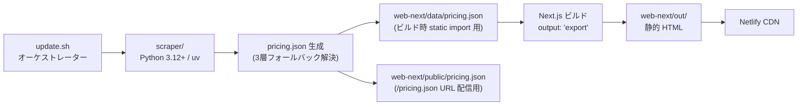
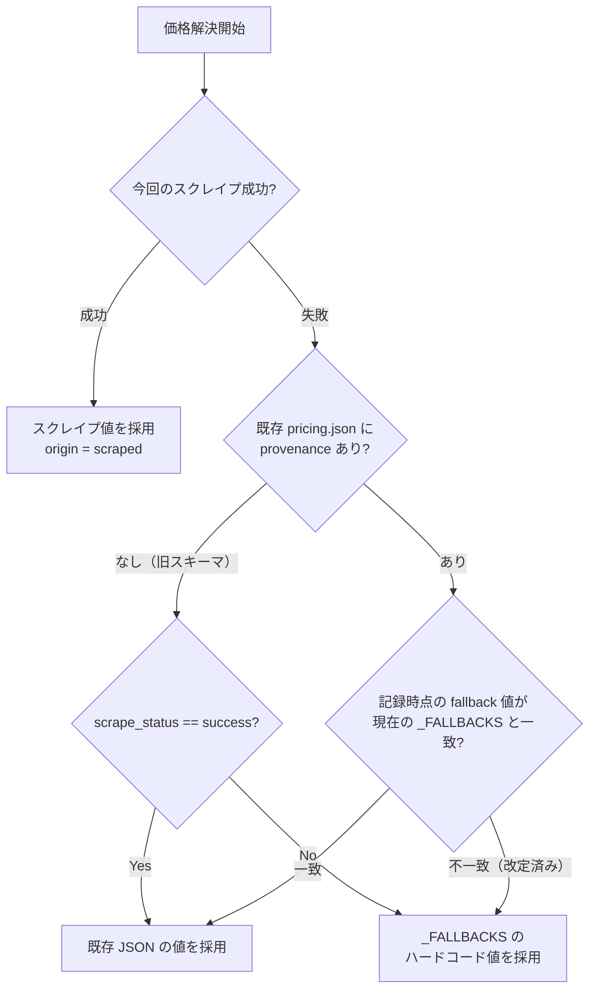
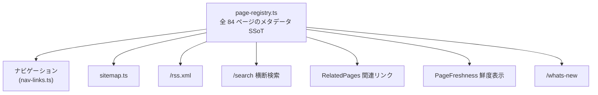

# プロジェクト詳細

最終更新日: 2026-09-18

> クイックスタートは [`README.md`](../README.md)、アーキテクチャの一次情報は [`CLAUDE.md`](../CLAUDE.md) を参照。本ドキュメントはそれらを俯瞰する形で「00 概要 / 01 主な機能 / 02 アーキテクチャ / 03 構成と制約 / 04 品質と未検証の範囲 / 05 参照コード」の 6 項目に整理したものです。

---

## 00 概要

LLM-Studies は、単一リポジトリで 2 つの役割を担うプロジェクトです。

| 役割 | 内容 | 主な成果物 |
|---|---|---|
| AI モデル コスト計算機 | 各社 API / サブスクツールの料金を横断比較する Web アプリ | `pricing.json`, `web-next/out/` |
| AI ツール導入ガイド群 | Claude Code / OpenAI Codex / GitHub Copilot / Gemini / Antigravity 等の設定・運用ガイド | `web-next/app/**/page.tsx`（84 ページ） |

処理の流れは大きく 2 段階です。

1. **Python スクレイパー**（`scraper/`）が各社の料金ページを取得し、`pricing.json` を生成する
2. **Next.js 16（App Router / SSG）**（`web-next/`）がその JSON をビルド時に読み込み、静的 HTML として書き出し、Netlify CDN から配信する

スクレイパーとフロントエンドは実行タイミングが分離されており、Netlify のビルドではスクレイパーは走らず、リポジトリにコミット済みの `pricing.json` をそのまま使う設計です。

---

## 01 主な機能

| 機能 | 概要 | 実装の中心 |
|---|---|---|
| コスト計算機 | API 従量課金モデルとサブスクツールの時間別コストを算出 | `app/page.tsx`, `components/HomePage.tsx`, `lib/cost.ts` |
| ガイドページ群（84 ページ） | プロバイダー/ツール別の導入・運用ガイド | `app/<provider>/<slug>/page.tsx` |
| 横断検索 | タイトル/要約/タグの全件部分一致検索、`?q=` `?tag=` で状態共有 | `app/search/`, `lib/search.ts` |
| What's New | 新着・最近更新ページの一覧 | `app/whats-new/` |
| RSS フィード | `output: 'export'` 下でも静的生成される RSS 2.0 | `app/rss.xml/route.ts` |
| 関連ページ表示 | 共有タグ数などに基づく決定論的な関連リンク | `components/site/RelatedPages`, `lib/related-pages.ts` |
| 鮮度表示 | 各ページの最終確認日を表示 | `components/site/PageFreshness` |
| JA/EN バイリンガル基盤 | `T` オブジェクト + `t()`/`tRich()` によるテキスト管理（現状ガイドページは JA 固定） | `lib/i18n.tsx` |
| 3 層フォールバック価格解決 | スクレイプ失敗時も過去の実績値・ハードコード値で価格を維持 | `scraper/src/scraper/provenance.py` |

### コスト計算機の入出力（`lib/cost.ts`）

コスト計算機はすべて副作用のない純粋関数で構成されており、以下の入出力契約を持ちます。

| 関数 | 入力 | 出力 | 振る舞い |
|---|---|---|---|
| `calcApiCost` | `priceIn`（USD/100万トークン）, `priceOut`, `inputTokens`, `outputTokens`, `hours` | USD 金額 | `(input/1e6 * priceIn + output/1e6 * priceOut) * hours` の単純計算。丸め処理なし |
| `calcSubCost` | `monthly`（USD月額）, `annual`（USD年額 or `null`）, `hours` | USD 金額 | `hours >= 8760` は年額をそのまま採用、`hours <= 720` は月額を時間按分、それ以外は `hours/720` で月額を按分。`monthly=0` かつ `annual` 未設定なら常に 0 |
| `colorIndex` | 金額 | 表示用インデックス | UI 上の価格帯の色分けに使用 |
| `fmtUSD` / `fmtJPY` | 金額（+ `fmtJPY` は為替レート） | 表示用文字列 | `$0.001` 未満は `<$0.01` と表示。`fmtJPY` は `ja-JP` ロケールで桁区切り |

期間プリセット（`PERIODS`）は `1h / 8h / 24h / 7d / 30d / 4mo / 12mo` の 7 段階固定（`web-next/lib/cost.ts:13-21`）。ユーザーはこの期間とモデル/ツールを選択し、`HomePage.tsx` が `pricing.json`（`data/pricing.json` から static import）の価格データと組み合わせて上記関数を呼び出し、比較表を描画します。

---

## 02 アーキテクチャ

### データパイプライン全体



Netlify 側のビルドコマンドは `bun install && bun run build` のみで、スクレイパーは実行されません。価格データの更新は開発者がローカルまたは Docker で `update.sh` を実行し、生成された `pricing.json` をコミットする運用です。

### 価格の 3 層フォールバック解決

各 API モデルの価格は「今回のスクレイプ結果」だけでなく、過去の実績（`provenance`）とハードコード値（`_FALLBACKS`）を突き合わせて決定します。



この設計により、①スクレイプが連続で失敗しても過去の成功値が不用意に破棄されない、②月次の価格改定は `_FALLBACKS` の書き換えだけで確実に反映される、という 2 つの要件を両立しています（詳細は `scraper/src/scraper/provenance.py` の `FallbackResolver`）。

### ページレジストリ（SSoT）からの導出

フロントエンドの横断的な機能は、すべて `web-next/lib/page-registry.ts` という単一のメタデータ定義から導出されています。属性をページごとに複製しないのが設計上の強い制約です。



ナビゲーションの並び順・ネスト対象だけは `lib/nav-taxonomy.ts` が別途保持します（registry のエントリは slug 昇順のため表示順を表現できないため）。

### ディレクトリ構成（主要パス）

| パス | 役割 |
|---|---|
| [`update.sh`](../update.sh) | scrape → copy を実行するオーケストレーター |
| [`scraper/src/scraper/main.py`](../scraper/src/scraper/main.py) | スクレイパー CLI エントリポイント |
| [`scraper/src/scraper/models.py`](../scraper/src/scraper/models.py) | `PricingData` / `ApiModel` / `SubTool` の Pydantic スキーマ（型の SSoT） |
| [`scraper/src/scraper/provenance.py`](../scraper/src/scraper/provenance.py) | 3 層フォールバックの出自解決（`FallbackResolver`） |
| `scraper/src/scraper/providers/` | API プロバイダー別スクレイパー（anthropic / openai / google / aws / deepseek / xai / moonshot / zhipu） |
| `scraper/src/scraper/tools/` | コーディングツール別スクレイパー（cursor / github_copilot / windsurf / claude_code / jetbrains / openai_codex / google_one / antigravity） |
| [`web-next/lib/page-registry.ts`](../web-next/lib/page-registry.ts) | 全ページメタデータの SSoT |
| [`web-next/lib/pricing.ts`](../web-next/lib/pricing.ts) | Zod スキーマ + 型パリティのコンパイル時検証 |
| `web-next/app/` | App Router のページ実体（コスト計算機ホーム + 84 ガイドページ） |
| `web-next/components/site/` | 共通インフラ（`SiteHeader` / `DisclaimerBanner` / `PageFreshness` / `RelatedPages`） |
| [`web-next/data/pricing.json`](../web-next/data/pricing.json) | ビルド時 static import 用 |
| [`web-next/public/pricing.json`](../web-next/public/pricing.json) | `/pricing.json` URL 配信用 |
| [`netlify.toml`](../netlify.toml) | Netlify デプロイ設定 |
| `legacy/` | 旧 Vite/HTML 資産。`.gitignore` 済・移行完了につき編集凍結 |

---

## 03 構成と制約

### 技術スタック

| レイヤー | 技術 | バージョン/備考 |
|---|---|---|
| フロントエンド フレームワーク | Next.js（App Router） | 16.3.4、`output: 'export'` による pure SSG |
| UI ライブラリ | React | 19.2.4 |
| 型システム | TypeScript | `strict: true` + `noUnusedLocals` + `noUnusedParameters`。`enum`/`namespace` 禁止（`erasableSyntaxOnly`） |
| スタイリング | Tailwind CSS v4 + CSS Modules | `globals.css` の `@theme` / `:root` 併記が本番ビルド安定化の対策 |
| バリデーション | Zod | `^4.3.6`。`pricing.json` の実行時検証に使用 |
| 図解 | Mermaid | 10.9.8。共有コンポーネント `MermaidDiagram.tsx` がレイアウトの SSoT |
| Lint/Format | Biome | `^2.4.11` |
| テスト（フロント） | Vitest | jsdom + `@` alias |
| パッケージマネージャー（フロント） | Bun | npm/npx/node 系コマンドは使用しない運用 |
| バックエンド言語 | Python | `>=3.12` |
| パッケージマネージャー（バック） | uv | |
| データモデル | Pydantic | `>=2.10.0`。型の SSoT |
| ブラウザ自動化（スクレイプ用） | Playwright | `>=1.49.0` |
| HTTP クライアント | httpx | `>=0.28.0` |
| テスト（バック） | pytest | `>=9.0.3` |
| デプロイ先 | Netlify | `base=web-next`, `publish=out`。ビルドのみ実行、スクレイパーは走らない |

### 主要コマンド

```bash
# フロントエンド
cd web-next && bun run dev         # 開発サーバー
cd web-next && bun run build       # 静的エクスポート → out/
cd web-next && bun run test        # vitest
cd web-next && bun run typecheck   # tsc --noEmit
cd web-next && bun run lint        # Biome check

# バックエンド
cd scraper && uv run python -m scraper.main --output ../pricing.json
cd scraper && uv run pytest

# 全体更新
bash update.sh              # フルパイプライン
bash update.sh --no-scrape  # 為替レートのみ更新
```

### 主な制約（AI エージェント向けルールの要点）

このリポジトリは AI アシスト前提で運用されており、`CLAUDE.md` に明文化された禁止事項があります。

- ファイル全体の書き直し・依存関係アップグレード・ビルドツール設定変更を、明示指示なしに行わない
- `legacy/` 配下（移行完了・凍結中）を編集しない
- 元 HTML/Markdown ガイドの Next.js 移植は **100% 忠実転写**が絶対ルール（代表例のみの抜粋・要約は違反）
- 型は `scraper/src/scraper/models.py`（Pydantic）が SSoT、`web-next/types/pricing.ts` は手動ミラー。片方の変更時は両方を同期する
- ナビゲーションは `page-registry.ts` からの導出のみ。`nav-links.ts` への手書き禁止
- コミット対象ファイルにユーザー名を含む絶対パスを記載しない（[`.claude/rules/no-absolute-paths.md`](../.claude/rules/no-absolute-paths.md)）
- Mermaid 図解のレイアウト（中央寄せ・縮小フィット）はページ側で再実装せず共有コンポーネントに一任する（[`.claude/rules/mermaid-diagram-layout.md`](../.claude/rules/mermaid-diagram-layout.md)）
- `globals.css` 変更後は `web-next/.next` を削除して再起動する（[`.claude/rules/css-cache-reset.md`](../.claude/rules/css-cache-reset.md)）

---

## 04 品質と未検証の範囲

### テスト構成（2026-09-18 実測。詳細は [`docs/TESTING.md`](TESTING.md)）

| 種別 | ツール | 結果 |
|---|---|---|
| フロントエンド | Vitest | 177 files / **1639 tests** 全 Green（`bun run test` を実行し確認） |
| バックエンド | pytest | 5 files（`test_providers.py` / `test_imports.py` / `test_browser.py` / `test_tools.py` / `smoke/test_smoke.py`） / **100 tests** 全 Green（`uv run pytest` を実行し確認） |
| E2E | Playwright（`web-next/e2e/`） | 実装済みだが CI 未組込。`calculator.e2e.ts` は現行 DOM に存在しない `#scenario-selector` / `#api-pricing-table` を参照しており、実行すれば失敗する可能性が高いことをソース照合で確認済み |

### テストポリシー

- 許可: import スモークテスト、純粋関数テスト、決定論的コンポーネントレンダリングテスト
- 禁止: スナップショットテスト、ブラウザ自動化テスト、ネットワークテスト、重い結合テスト
- Playwright MCP はこのプロジェクトでは方針として使用しない。静的 HTML / React アプリの目視確認はユーザーが手動で行う運用（`CLAUDE.local.md`）

### 意図的に未検証・簡略化されている領域

- **Google AI/Vertex の価格取得**（`scraper/src/scraper/providers/google.py`）は、料金ページの構造的不安定性（モデル名の複数出現、価格ラベルの曖昧さ）を理由に、意図的にライブスクレイプを行わずハードコード値（`_FALLBACKS`）に固定されています。これは「バグ」ではなく設計判断です
- 各プロバイダーのスクレイプ成功率はネットワーク環境・料金ページの HTML 構造変更に依存するため、リポジトリの静的読解だけでは実行時の成否を保証できません
- SonarQube Cloud 解析（`make sonar`）は `SONAR_TOKEN` 等の初回手動セットアップが前提であり、未設定環境では実行できません
- **GitHub Actions（`.github/workflows/test.yaml`）は `bun run test` と `uv run pytest` のみを実行し、`typecheck` / `lint` / `build` / E2E は含みません**。これらは `CLAUDE.md` に定める「コミット前チェック」としてローカル/エージェント側の運用に委ねられており、リモート CI では強制されていません
- **`web-next/e2e/` の Playwright E2E テストは CI 未組込かつ一部が現行実装と不整合**: `calculator.e2e.ts` の `should load calculator UI elements` は `#scenario-selector` / `#api-pricing-table` という ID を参照しますが、この ID はリポジトリ全体（テストファイル自身を除く）のどこにも定義されておらず、実行すれば失敗する可能性が高いことを確認済みです。旧 Vite 版（`legacy/`）由来のテストが Next.js 移行後も更新されず残存したものと推測されます。詳細は [`docs/TESTING.md`](TESTING.md) の「E2E テストの位置づけ」を参照

### 品質担保の仕組み（機械的チェック）

| 目的 | 手段 |
|---|---|
| ページレジストリの登録漏れ・幽霊エントリ検知 | `web-next/tests/page-registry-coverage.test.ts` |
| registry ⇔ ナビの全単射検証 | `web-next/tests/nav-derivation.test.ts` |
| 型定義のパリティ検証（Pydantic ⇔ TypeScript） | `web-next/lib/pricing.ts` の `_AssertParity`（コンパイル時） |
| コミット差分内の PII/絶対パス検出 | `.claude/rules/no-absolute-paths.md` に定める `git diff --cached` の grep チェック |

---

## 05 参照コード

| 項目 | 参照先 |
|---|---|
| プロジェクト全体の一次情報（AI エージェント向け） | [`CLAUDE.md`](../CLAUDE.md) |
| リポジトリ概要（人間向け） | [`docs/README.md`](README.md) |
| テスト戦略 | [`docs/TESTING.md`](TESTING.md) |
| 現在の進捗 | [`docs/PROGRESS.md`](PROGRESS.md) |
| Phase A–F 移行計画（アーカイブ） | [`docs/archive/NEXTJS_PHASE_A_F_PLAN.md`](archive/NEXTJS_PHASE_A_F_PLAN.md) |
| 型スキーマ（Python 側 SSoT） | [`scraper/src/scraper/models.py`](../scraper/src/scraper/models.py) |
| 型スキーマ（TypeScript 側ミラー） | [`web-next/types/pricing.ts`](../web-next/types/pricing.ts) |
| 3 層フォールバック解決ロジック | [`scraper/src/scraper/provenance.py`](../scraper/src/scraper/provenance.py) |
| ページメタデータ SSoT | [`web-next/lib/page-registry.ts`](../web-next/lib/page-registry.ts) |
| ナビ表示順の定義 | [`web-next/lib/nav-taxonomy.ts`](../web-next/lib/nav-taxonomy.ts) |
| コスト計算の純粋関数 | [`web-next/lib/cost.ts`](../web-next/lib/cost.ts) |
| Mermaid 共有コンポーネント | [`web-next/components/docs/MermaidDiagram.tsx`](../web-next/components/docs/MermaidDiagram.tsx) |
| i18n（JA/EN テキスト管理） | [`web-next/lib/i18n.tsx`](../web-next/lib/i18n.tsx) |
| Netlify デプロイ設定 | [`netlify.toml`](../netlify.toml) |
| Docker 管理 | [`Makefile`](../Makefile), [`docker-compose.yml`](../docker-compose.yml) |
