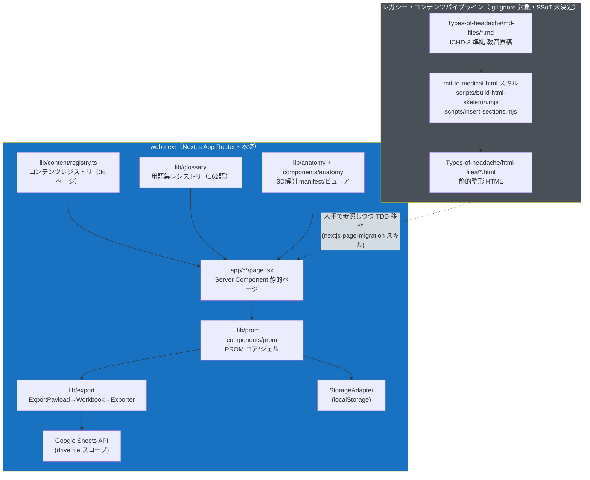
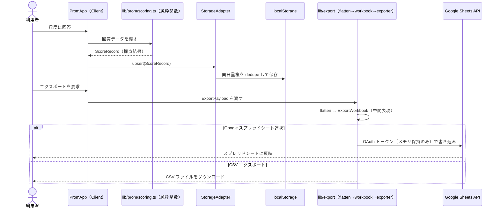

# プロジェクト概要ドキュメント（開発者向け包括ガイド）

> **文書種別**: 開発チーム参照用の包括ドキュメント
> **作成日**: 2026-09-18
> **対象範囲**: リポジトリ全体（`web-next/` アプリを中心に、コンテンツ資産・移行パイプライン・公開ガバナンス文書群を含む）
> **注記**: 本文書はソースコード・既存設計書（`GEMINI.md` / `CLAUDE.md` / `PROGRESS.md` / `plans/` / `docs/publishing/` 等）を突き合わせて作成した。推測を含む箇所は都度明示する。

---

## 00. 概要

### 背景

本リポジトリは、国際頭痛分類第3版（ICHD-3）に基づくエビデンスベースの頭痛疾患医療教育コンテンツを執筆・公開するスタディプロジェクトとして開始した。当初は Markdown（`Types-of-headache/md-files/`）で執筆し、スタイル付き静的 HTML（`Types-of-headache/html-files/`）へ変換する構成だった。これと並行して、患者向けの PROM（Patient-Reported Outcome Measures：患者報告アウトカム）を自己記録・採点する単一 HTML SPA（`prom-checker/index.html`）が別系統で開発された。

現在は、この 2 系統のコンテンツ・機能を **Next.js App Router アプリ（`web-next/`）へ統合移行中**である（`nextjs-page-migration` スキルによる TDD 移行）。`PROGRESS.md` によれば教育記事側の移行対象 HTML は残数 0 であり、`web-next/app/` 配下のページ数（40、2026-09-18 実測）は「コンテンツレジストリ登録数（36）＋レジストリ管理外の静的ルート 4（`/`・`/prom-checker`・`/privacy`・`/terms`）」と完全に一致する（後述 02/05 節で詳述）。

### 目的

- 頭痛に関する解剖・病態生理・神経ブロック手技・薬物/非薬物治療・PROM を、単一の Web アプリから一貫した UI/UX で提供する。
- 学習者（医学生・研修医）が構造の立体的位置関係を把握できる 3D 解剖アトラス（`/anatomy`）を提供する。
- 患者が頭痛日誌・尺度スコアをローカル端末内で自己記録し、必要に応じて外部（Google スプレッドシート／CSV）へエクスポートできるようにする。
- 「教育専用・診断補助なし・薬機法 SaMD 非該当」という不変の原則（`plans/001-platform-vision-and-current-state.md`）を維持する。

### ゴール

| ゴール | 現状（推測を含む場合は注記） |
|---|---|
| 教育コンテンツの web-next 完全移行 | `Types-of-headache/` は `.gitignore` 対象となり SSoT（Single Source of Truth）方針が未決定。新規コンテンツ執筆を伴う `plans/005`・`006` は BLOCKED |
| PROM/日誌のローカルファースト実装 | `web-next/lib/prom/` + `components/prom/` として実装済み。テストで契約を担保 |
| 3D 解剖アトラス | コード実装済み（遅延ロード・ホットスポット注釈・検索・サイドナビ）。実 glTF 資産投入と Lighthouse 実測は未着手（`docs/architecture.md` Phase 2/4） |
| 公開リポジトリとしてのガバナンス確立 | `docs/publishing/` の監査所見 F1〜F7 のうち F1〜F6 は実装計画（`plans/008`〜`014`）が DONE、F7（git 履歴の author メール書き換え）は `plans/015` が TODO |

### ターゲットユーザーと提供価値

| ユーザー | ニーズ | 提供価値 |
|---|---|---|
| 医学生・研修医 | 頭痛の解剖・病態・神経ブロック手技を立体的かつエビデンスベースで理解したい | 3D 解剖アトラス、ICHD-3 準拠の教育記事、Mermaid 図解、参考文献リンク |
| 患者（頭痛外来通院者等） | 自分の頭痛の仕組みを平易に理解し、症状を記録して受診時に活用したい | PROM 統合チェッカー（HIT-6/MIDAS/MSQ/PGIC/NRS-VAS/日誌）、用語集ツールチップによるやさしい言い換え、ローカル保存によるプライバシー保護 |
| 開発チーム（本リポジトリのメンテナ） | 医療教育コンテンツと自己記録ツールを、法務・セキュリティ上安全な形で公開・保守したい | CSP 等のセキュリティヘッダ、著作権保護尺度の redaction 運用、CI ゲート（型・Lint・テスト・ライセンス） |

---

## 01. 主な機能

### 機能一覧

| カテゴリ | 機能 | 主なルート | 概要 |
|---|---|---|---|
| PROM 統合チェッカー | 尺度記入・採点・ダッシュボード | `/prom-checker` | HIT-6・MIDAS・MSQ v2.1・PGIC・NRS/VAS・頭痛日誌・SNOOP4（危険徴候）をローカルファーストで記録・採点 |
| PROM 解説ページ | 各尺度の教育記事 | `/prom/headache-diary` 等 6 ページ | 尺度の意義・採点方法・臨床的解釈を解説する静的教育記事 |
| 頭痛疾患解説 | 疾患別教育記事 | `/headaches/*`（5 ページ） | 片頭痛・緊張型頭痛・頸原性頭痛・薬物乱用頭痛・病態生理をエビデンスベースで解説 |
| 神経ブロック解説 | 手技別教育記事 | `/blocks/*`（4 ページ） | 後頭神経ブロック等、代表的な頭痛関連神経ブロックの解剖学的根拠と手技を解説 |
| 治療ガイド | 治療方針の教育記事 | `/treatment/*`（7 ページ） | 急性期治療・予防治療・CGRP 標的薬・MOH（薬物乱用頭痛）予防・トリガー同定等 |
| 非薬物療法 | 療法別教育記事 | `/therapies/*`（7 ページ） | 理学療法・有酸素運動・栄養/サプリメント・心理行動療法・睡眠指導等 |
| 3D 解剖アトラス | 立体解剖の可視化 | `/anatomy` + サブページ 6 | glTF 3D モデル（遅延ロード）＋既存 MRI PNG スライスビューアを構造別に提示し、該当教育記事へ誘導 |
| 用語集ツールチップ | 専門用語のやさしい解説 | 全教育ページ共通 | 162 語（実測）の用語集レジストリを `AutoGlossary` が本文初出に自動適用。読み仮名＋平易な言い換えをツールチップ表示 |
| サイト内横断検索 | ヘッダー検索 | 全ページ共通 | `lib/content/search.ts` のコアロジックを `SiteSearch.tsx` が消費。コンテンツレジストリ 36 ページを索引（2026-09-18 実測） |
| 外部エクスポート | Google スプレッドシート同期／CSV | `/prom-checker` 内 | `lib/export/` の三層分離（`ExportPayload` → 純粋な `ExportWorkbook` → `ReportExporter`）で、Google Sheets API（`drive.file` 最小スコープ）または CSV へ出力 |
| 法務ページ | プライバシー・利用規約 | `/privacy`, `/terms` | SaMD 非該当・データ非送信の説明を含む静的ページ |
| コンテンツ生成パイプライン（レガシー） | md → HTML 変換 | リポジトリ直下 `scripts/`・`.claude/skills/md-to-medical-html` | `Types-of-headache/` 配下の Markdown をスタイル付き HTML へ変換する運用スキル群（現在 `Types-of-headache/` は `.gitignore` 対象） |

### 主要機能の入出力・振る舞い（抜粋）

| 機能 | 入力 | 出力 | 備考 |
|---|---|---|---|
| PROM 尺度記入 | ユーザーの回答選択 | `ScoreRecord`（`localStorage` へ保存） | `lib/prom/scoring.ts` が純粋関数として採点。`upsert.ts` が同日重複記録を dedupe |
| データエクスポート | `localStorage` 上の `ExportPayload` | Google スプレッドシート更新 or CSV ファイル | `flatten.ts` → `workbook.ts` → 各 `ReportExporter` 実装（`CsvExporter` / `GoogleSheetsExporter`）の順で変換。中間表現 `ExportWorkbook` がフォーマット非依存 |
| 制限尺度（HIT-6/MSQ）表示 | `public/prom-restricted.local.json`（任意・gitignore 対象） | 質問文の実表示、または redaction 済みプレースホルダ | 本番ビルド（`NODE_ENV=production`）では読み込まれない二重ゲート。件数不一致時はオーバーレイを破棄しプレースホルダへフォールバック |
| 3D 解剖ビューア | `lib/anatomy/manifest.ts` の宣言的データ | `<model-viewer>` によるインタラクティブ 3D 表示 | マウント時に動的 `import()`。読込失敗時はビューアのみ欠落しページ自体は機能する降格戦略 |
| 用語集ツールチップ | 本文内の用語文字列 | 読み仮名＋やさしい解説のポップアップ | `AutoGlossary` が本文ルートを走査し初出のみ `<Term>` に自動変換 |

---

## 02. アーキテクチャ

### システム全体設計と責務分離

本リポジトリには**系統の異なる 2 つのサブシステム**が存在する。

1. **レガシー・コンテンツパイプライン**（`Types-of-headache/`, `scripts/`, `.claude/skills/md-to-medical-html` 等）: Markdown 執筆 → 静的整形 HTML 変換という、Next.js 化以前のワークフロー。`Types-of-headache/` は `.gitignore` 対象（`ebdd955` コミットで untrack 化）であり、**リポジトリ内には存在しないためコード上から直接参照できない**（`plans/README.md` の注記による）。
2. **web-next アプリ**（`web-next/`）: 本流の実装。Next.js App Router 上に、教育記事（Server Component による静的ページ）と PROM/3D 解剖（Client Component アイランドを含むインタラクティブ機能）を統合する。

### web-next 内部設計: Server Component シェル + Client アイランド

`web-next` は原則として **全ページを静的プリレンダ**する（`next.config.ts` のコメントに明記）。重量ライブラリ（Mermaid、`@google/model-viewer`、DRACO デコーダ wasm 等）はページ本体には含めず、マウント時に動的 `import()` する Client Component（アイランド）として遅延ロードする。この方針は `components/MermaidDiagram.tsx` を先行パターンとし、`components/anatomy/ModelViewer.tsx` / `MriSliceViewer.tsx` が同型で追従する。ライブラリ読込に失敗した場合もページ自体は機能を維持する「降格表示」戦略を共通で採る。

### データフロー: PROM 記録からエクスポートまで

### セキュリティ・アーキテクチャ

`web-next` はサーバサイド API・サーバ秘密情報を持たない完全クライアント型アプリである（`app/api/` は存在しない、`SECURITY.md` 記載）。`next.config.ts` が `lib/security/csp.ts` の純粋関数からセキュリティヘッダ（CSP, HSTS, X-Frame-Options 等）を静的生成し、全ルートへ強制付与する。CSP は `script-src` に `'unsafe-inline'` を許容しており（Next.js の inline bootstrap script のため、per-request nonce は静的プリレンダと両立しない）、これは `docs/publishing/04-security-policy.md` に**受入済み残余リスク**として明記されている（詳細は 03/04 節）。

---

## 03. 構成と制約

### 技術スタック

| カテゴリ | 採用技術 | 備考 |
|---|---|---|
| フレームワーク | Next.js 16.2.11 / React 19.2.4 | App Router、Server Component 主体 |
| 言語 | TypeScript 5.x（strict） | `any` 禁止方針（プロジェクト CLAUDE.md 準拠） |
| パッケージマネージャ | bun 1.3.14 | `bun install --frozen-lockfile` を CI で使用 |
| スタイル | Tailwind CSS v4 + scoped CSS | `Types-of-headache/html-files/Headaches/Migraine.html` 由来の CSS 変数を継承 |
| 3D 描画 | `@google/model-viewer` ^4.3.1 | 遅延ロード、Web Component |
| 3D アセット変換 | `@gltf-transform/*`, `obj2gltf`, `draco3dgltf` | BodyParts3D 等のモデルを glTF/GLB 化するビルド時ツール |
| 図解 | Mermaid 10.9.8 | HTML/Next.js 双方で使用。SRI ハッシュ・エンティティエスケープの規約あり |
| Lint/Format | Biome ^2.5.0 | `bun run lint` / `lint:fix` |
| テスト | Vitest ^4.1.4 + Testing Library | `test` / `test:coverage` / `test:watch` |
| 外部連携 | Google Sheets API（`drive.file` スコープ） | OAuth をクライアント側で完結させ、サーバに秘密情報を保持しない設計。エクスポート時は選択したデータを Google Sheets API へ送信 |
| CI | GitHub Actions | 5 ジョブ（後述 04 節） |
| レガシー生成系 | Python 3.12（`scripts/bodyparts3d/*`）、Node.js（`scripts/*.mjs`） | BodyParts3D モデル抽出、Markdown 整形、HTML スケルトン生成 |

### ディレクトリ構成（主要ディレクトリの役割）

| パス | 役割 |
|---|---|
| `web-next/app/` | Next.js App Router のルート定義。40 の `page.tsx`（`headaches` / `blocks` / `treatment` / `therapies` / `anatomy` / `prom` / `prom-checker` / `privacy` / `terms` 等） |
| `web-next/lib/content/` | サイト横断コンテンツレジストリ（`registry.ts`・`search.ts`・`types.ts`）。新規ページ追加時は登録必須、登録漏れは契約テストが検知 |
| `web-next/lib/anatomy/` | 3D 解剖アトラスの宣言的 manifest・型検証・検索コア・PNG サニタイズ |
| `web-next/lib/prom/` | PROM コア（レジストリ・採点・永続化・日時処理・制限尺度ローダ） |
| `web-next/lib/export/` | エクスポート三層分離（`csv.ts` / `workbook.ts` / `flatten.ts` / `google/`） |
| `web-next/lib/glossary/` | 用語集レジストリ（162 語）と型検証 |
| `web-next/lib/security/` | CSP 生成の純粋関数 |
| `web-next/components/` | `anatomy` / `blocks` / `content` / `glossary` / `headaches` / `prom` / `site` / `therapies` / `treatment` の各 UI コンポーネント群 |
| `web-next/public/` | 静的配信アセット（3D モデル・MRI PNG・制限尺度オーバーレイのテンプレート等）。実ファイルは容量・ライセンス上の理由で一部未投入 |
| `Types-of-headache/` | レガシーの Markdown/HTML コンテンツ資産。**`.gitignore` 対象・SSoT 方針未決定**（詳細は後述） |
| `scripts/` | Markdown 整形、HTML スケルトン生成、BodyParts3D モデル抽出等のビルド時スクリプト |
| `docs/` | 設計書（`architecture.md`＝3D解剖アトラス設計、`google-sheets-sync-design.md`、`prom-patient-checker-design.md`）と公開ガバナンス監査（`publishing/`） |
| `plans/` | 実装計画群（001〜007 コンテンツ戦略系、008〜015 公開ガバナンス系）。各計画は Status 欄で進捗管理 |
| `.claude/skills/` | プロジェクト固有の運用スキル（Markdown→HTML変換、Mermaid修正、CSS デザインシステム継承、ドキュメント同期等） |
| `BodyParts3D/`, `images/`, `diagnosis/` | 生データ・患者データ由来アセット。`.gitignore` で除外済み（`docs/publishing/README.md` 記載の「良好な点」） |

### 技術的制約・環境制約・依存関係

| 制約 | 内容 | 出典・根拠 |
|---|---|---|
| サーバ API なし | `web-next` はクライアント完結型。サーバ秘密情報を持たない設計 | `SECURITY.md` |
| CSP の残余リスク | `script-src 'unsafe-inline'` を許容しており inline XSS 防御は無効。受入済みリスクとして文書化済み | `docs/publishing/04-security-policy.md` §3、`plans/README.md` Plan 011 |
| PROM 著作権制約 | HIT-6・MSQ v2.1 の質問文は権利者所有のためリポジトリに掲載していない。ローカル専用オーバーレイ（gitignore 対象）でのみ復元可能。本番ビルドでは読み込まれない二重ゲート | `web-next/README.md`、`plans/README.md` Plan 008（F1 是正、DONE） |
| 3D モデルのライセンス | BodyParts3D/Anatomography 由来モデルは CC-BY-SA 2.1 JP。ShareAlike 条件により、コード（MIT）とは別スコープでライセンス管理 | `docs/architecture.md` §5.2/§8.3、`LICENSE`、`THIRD_PARTY_NOTICES.md` |
| コンテンツ SSoT 未決定 | `Types-of-headache/`（md-files/html-files）は `ebdd955` で `.gitignore` 化・untrack。新規コンテンツ執筆を伴う `plans/005`・`006` は BLOCKED | `plans/README.md`（2026-08-10 時点の IMPORTANT 注記） |
| スコープの恒久的除外 | DICOM 読込・患者固有 3D 再構築・AI 診断・用量計算機能等は SaMD 該当リスクのため採用しない方針 | `docs/architecture.md` §1.3、`plans/README.md`「見送り事項」 |
| markdownlint 適用範囲 | CI の markdown ジョブはルート `*.md` / `plans/` / `docs/publishing/` に限定。コンテンツ `.md` 側には既存負債 57 件が残る（別タスク） | `.github/workflows/ci.yml` コメント、`plans/README.md` Plan 014 |
| ライセンスゲート | 本番依存に強コピーレフト（GPL/AGPL 系）混入を CI で拒否 | `.github/workflows/ci.yml` `license-gate` ジョブ |
| 絶対パス禁止 | コミット対象ファイルに環境依存の絶対パス（`/Users/<name>/` 等）を含めてはならない。CI の `pii-check` ジョブで機械検証 | `.claude/rules/no-absolute-paths.md`、`.github/workflows/ci.yml` |

---

## 04. 品質と未検証の範囲

### テスト方針と現在の保証状況

| 種別 | 対象 | ツール | 方針 |
|---|---|---|---|
| 単体テスト | 純粋関数コア（`scoring.ts`, `flatten.ts`, `search.ts`, `csp.ts` 等） | Vitest | 正常系＋異常系（不正データ時の例外等）を先行してテストする方針（`docs/architecture.md` §9 に明記の例あり） |
| 契約テスト | 各 `app/**/page.tsx` | Vitest + Testing Library | hero・セクション構成・ディスクレーマー・外部リンク属性等を固定。重いビューア（3D/Mermaid）は `vi.mock` で代替 |
| レジストリ整合性テスト | `lib/content/registry.ts` | Vitest | 登録漏れ・dangling 参照・実ルートとの不一致を機械検知（`registry.test.ts`） |
| 視覚確認 | `/anatomy` 全体等 | 手動（開発サーバで目視） | 3D 回転・MRI スクラブ・リンク遷移の自動テストは未整備。手動確認に依存 |
| CI 品質ゲート | `web-next` 全体 | GitHub Actions（5 ジョブ） | 下表参照 |

> **テスト件数について（2026-09-18 実測・HEAD `e9b09fc`）**: `cd web-next && bun run test` を実行した結果は **837 passed / 79 ファイル**（`typecheck` / `lint` も同時点でクリーン）。`PROGRESS.md` に記載された過去のスナップショット（2026-08-14 時点「575 passed / 41 ファイル」、2026-08-12 時点「B 系統〈PROM/export〉132 passed ＝ 全体 694 passed / 72 ファイルの一部」）は、その後のコンテンツ・機能追加により**現時点では古い**。テスト件数は**実行範囲と計測時点を必ず添えて**記録し、最新値が必要な場合は都度 `bun run test` を再実行すること（本リポジトリの `PROGRESS.md` 自身が定める運用規約）。

### CI パイプライン（`.github/workflows/ci.yml`）

| ジョブ | 内容 |
|---|---|
| `web-next` | `bun run typecheck` / `lint` / `test` / `build`（`NEXT_PUBLIC_SITE_URL` をプレースホルダで注入） |
| `license-gate` | 本番依存の強コピーレフトライセンス混入を拒否（`license-checker-rseidelsohn`） |
| `markdown` | ルート `*.md` / `plans/**` / `docs/publishing/**` の markdownlint（コンテンツ `.md` は対象外） |
| `mermaid-script` | `.claude/skills/fix-mermaid` の Mermaid 修正スクリプトの pytest |
| `pii-check` | 追跡ファイル全体に環境依存の絶対パス（PII 相当）が無いことを `git grep` で検証 |

### 未検証の範囲・エッジケース

| 項目 | 状態 |
|---|---|
| 3D 解剖アトラスの実 glTF 資産投入 | 未着手（`docs/architecture.md` Phase 2 は「コード実装済み・資産投入待ち」） |
| Lighthouse 実測（パフォーマンス） | 未着手（`docs/architecture.md` Phase 4、`PROGRESS.md` の「次の作業」欄に記載） |
| Google Sheets 同期の実機確認 | `NEXT_PUBLIC_GOOGLE_CLIENT_ID` 設定後の実機検証待ち（`PROGRESS.md`）。ただし `plans/README.md` Plan 011 では CSP 検証の一環として実 OAuth フローを確認済みとの記述もあり、**検証範囲の粒度に差異がある**ため要確認 |
| コンテンツ SSoT 方針 | 未決定。`Types-of-headache/` が `.gitignore` 対象のため、新規コンテンツ拡張（`plans/005`・`006`）は着手不能 |
| git 履歴の author メールアドレス書き換え | `plans/015`（F7 是正）が TODO のまま。破壊的操作のため決定ゲート待ち |
| プライバシーポリシー・利用規約の文言 | `plans/013` により実装済みだが、文言自体は「暫定版・法務レビュー待ち」と明記されている |
| 視覚回帰テスト | 自動化されていない。3D/MRI/UI の見た目は手動確認のみ |

### 既知の制限事項・技術的負債

| 項目 | 内容 |
|---|---|
| CSP `unsafe-inline` の残余リスク | Next.js の静的プリレンダと nonce ベース CSP が両立しないための設計上のトレードオフ。inline XSS 防御は無効だが、リスク受容の根拠と再評価条件を文書化済み（`docs/publishing/04-security-policy.md` §3） |
| コンテンツ `.md` の markdownlint 負債 | 57 件が未修正のまま CI 対象外（`plans/README.md` Plan 014） |
| root 直下の残置ファイル | `Vascular-headache.html` / `Vascular-headache.md` が git 上で削除（`D`）状態のまま残っている（本書作成時点の `git status`）。移行過程の残骸である可能性が高いが、コミット履歴の意図確認が必要 |

---

## 05. 参照コード

### 主要ファイル・ディレクトリと役割

| パス | 役割・主要ロジック |
|---|---|
| [web-next/next.config.ts](https://github.com/myoshi2891/Medical-Studies/blob/main/web-next/next.config.ts) | セキュリティヘッダ・CSP の静的付与、Turbopack ルート設定 |
| [web-next/lib/security/csp.ts](https://github.com/myoshi2891/Medical-Studies/blob/main/web-next/lib/security/csp.ts) | CSP 文字列を組み立てる純粋関数（`buildContentSecurityPolicy`） |
| [web-next/lib/content/registry.ts](https://github.com/myoshi2891/Medical-Studies/blob/main/web-next/lib/content/registry.ts) | 全コンテンツページのメタ情報（カテゴリ・鮮度・関連ページ）を集約する SSoT レジストリ |
| [web-next/lib/content/search.ts](https://github.com/myoshi2891/Medical-Studies/blob/main/web-next/lib/content/search.ts) | サイト内横断検索の純粋関数コア |
| [web-next/lib/anatomy/manifest.ts](https://github.com/myoshi2891/Medical-Studies/blob/main/web-next/lib/anatomy/manifest.ts) | 3D 解剖アトラスの構造・モデルパス・MRI・md リンクを宣言する manifest |
| [web-next/lib/anatomy/types.ts](https://github.com/myoshi2891/Medical-Studies/blob/main/web-next/lib/anatomy/types.ts) | `validateManifest` 等、`any` を使わない型ガードによる検証ロジック |
| [web-next/lib/anatomy/png-sanitize.ts](https://github.com/myoshi2891/Medical-Studies/blob/main/web-next/lib/anatomy/png-sanitize.ts) | 公開用 MRI PNG から PHI 相当メタデータ（tEXt 等）を除去する処理 |
| [web-next/lib/prom/registry.ts](https://github.com/myoshi2891/Medical-Studies/blob/main/web-next/lib/prom/registry.ts) | HIT-6/MIDAS/MSQ 等 PROM 尺度の宣言的レジストリ（制限尺度は redaction 済み） |
| [web-next/lib/prom/scoring.ts](https://github.com/myoshi2891/Medical-Studies/blob/main/web-next/lib/prom/scoring.ts) | 尺度別の採点ロジック（純粋関数） |
| [web-next/lib/prom/storage.ts](https://github.com/myoshi2891/Medical-Studies/blob/main/web-next/lib/prom/storage.ts) | `StorageAdapter` インターフェースと `localStorage` 実装（依存性逆転により将来の永続化先差し替えに対応） |
| [web-next/lib/prom/restricted-loader.ts](https://github.com/myoshi2891/Medical-Studies/blob/main/web-next/lib/prom/restricted-loader.ts) | 制限尺度のローカル専用オーバーレイ読み込み（本番ビルドでは無効化） |
| [web-next/lib/export/workbook.ts](https://github.com/myoshi2891/Medical-Studies/blob/main/web-next/lib/export/workbook.ts) | エクスポート中間表現 `ExportWorkbook` の構築（フォーマット非依存） |
| [web-next/lib/export/registry.ts](https://github.com/myoshi2891/Medical-Studies/blob/main/web-next/lib/export/registry.ts) | `ReportExporter`（CSV / Google Sheets）の宣言的レジストリ |
| [web-next/lib/export/google/sheetsClient.ts](https://github.com/myoshi2891/Medical-Studies/blob/main/web-next/lib/export/google/sheetsClient.ts) | Google Sheets API クライアント（`drive.file` 最小スコープ） |
| [web-next/lib/glossary/glossary.ts](https://github.com/myoshi2891/Medical-Studies/blob/main/web-next/lib/glossary/glossary.ts) | 用語集レジストリ本体（162 語、読み仮名＋やさしい解説） |
| [web-next/components/glossary/AutoGlossary.tsx](https://github.com/myoshi2891/Medical-Studies/blob/main/web-next/components/glossary/AutoGlossary.tsx) | 本文初出の専門用語を自動的に `<Term>` へラップするラッパーコンポーネント |
| [web-next/components/anatomy/ModelViewer.tsx](https://github.com/myoshi2891/Medical-Studies/blob/main/web-next/components/anatomy/ModelViewer.tsx) | `@google/model-viewer` の遅延ロード・失敗時降格表示 |
| [web-next/components/anatomy/MriSliceViewer.tsx](https://github.com/myoshi2891/Medical-Studies/blob/main/web-next/components/anatomy/MriSliceViewer.tsx) | MRI PNG スライスのスクラブ表示 |
| [web-next/components/site/SiteSearch.tsx](https://github.com/myoshi2891/Medical-Studies/blob/main/web-next/components/site/SiteSearch.tsx) | ヘッダー検索 UI（WAI-ARIA combobox） |
| [web-next/app/layout.tsx](https://github.com/myoshi2891/Medical-Studies/blob/main/web-next/app/layout.tsx) | ルートレイアウト（`SiteHeader` / `DisclaimerBanner` / `SiteFooter` を全ページ共通適用） |
| [web-next/app/sitemap.ts](https://github.com/myoshi2891/Medical-Studies/blob/main/web-next/app/sitemap.ts) | サイトマップ生成（`NEXT_PUBLIC_SITE_URL` 未設定時は本番ビルドを fail-closed で拒否） |
| [.github/workflows/ci.yml](https://github.com/myoshi2891/Medical-Studies/blob/main/.github/workflows/ci.yml) | CI 5 ジョブ定義（typecheck/lint/test/build・ライセンスゲート・markdown・Mermaid・PII チェック） |
| [docs/architecture.md](https://github.com/myoshi2891/Medical-Studies/blob/main/docs/architecture.md) | `/anatomy` 3D 解剖アトラスの詳細設計書（v1.3、リスコープ宣言を含む） |
| [docs/google-sheets-sync-design.md](https://github.com/myoshi2891/Medical-Studies/blob/main/docs/google-sheets-sync-design.md) | PROM の Google スプレッドシート同期／CSV エクスポート詳細設計 |
| [docs/publishing/README.md](https://github.com/myoshi2891/Medical-Studies/blob/main/docs/publishing/README.md) | 公開ガバナンス監査サマリ（F1〜F7）とステータス一覧 |
| [plans/README.md](https://github.com/myoshi2891/Medical-Studies/blob/main/plans/README.md) | 実装計画群（001〜015）の進行順・依存関係・Status 一覧 |
| [PROGRESS.md](https://github.com/myoshi2891/Medical-Studies/blob/main/PROGRESS.md) | コンテンツ移行進捗・テスト実測値・次の作業 |
| [.claude/rules/no-absolute-paths.md](../../.claude/rules/no-absolute-paths.md) | Portfolio のコミット対象ファイルへの絶対パス記載禁止ルールと CI 検証コマンド |

---

## 付記: 本文書作成にあたっての推測・確認事項の明示

- `web-next/app/` の `page.tsx` 数（40）とコンテンツレジストリ登録数（36）の関係は、`bun run` での実コード実行（`CONTENT_REGISTRY.length` / `getRelated()`）により**コンテンツ 36 ＋ レジストリ管理外の静的ルート 4（`/`・`/prom-checker`・`/privacy`・`/terms`）＝ 40 で完全に一致する**ことを検証済みである（初版作成時点では `plans/README.md` の古い数値〈30〉を引用したため未解決の差異として記載していたが、本改訂で解消した）。
- テスト件数（837 passed / 79 ファイル）・`typecheck`/`lint` クリーンは、本改訂時点（2026-09-18・HEAD `e9b09fc`）に `cd web-next && bun run test` / `typecheck` / `lint` を実際に実行して確認した実測値である。今後のコンテンツ・機能追加により再び古くなるため、正確な値が必要な場合は都度再実行すること。
- Google Sheets 同期の「実機確認」状況について、`PROGRESS.md`（未確認扱い）と `plans/README.md` Plan 011（確認済みと読める記述）の間に粒度の差があり、本書では両論を併記するに留めた（本項目は未検証のまま）。
