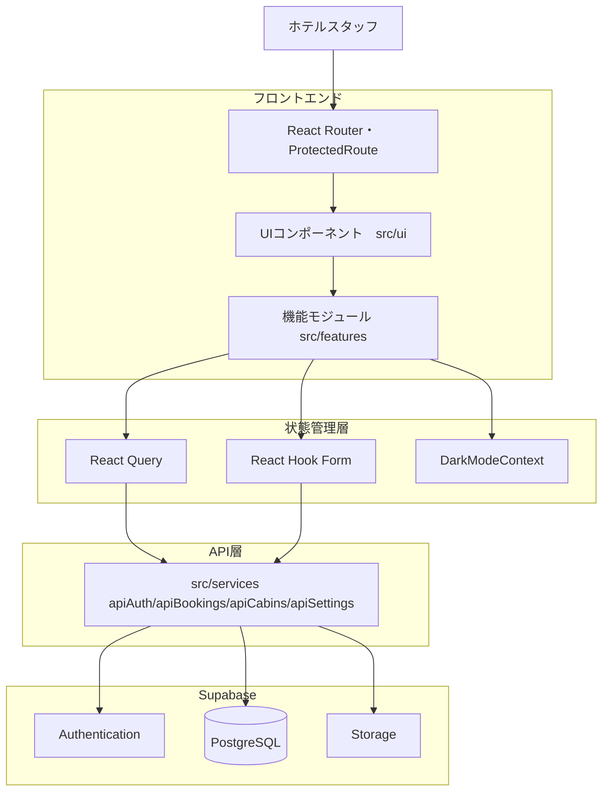
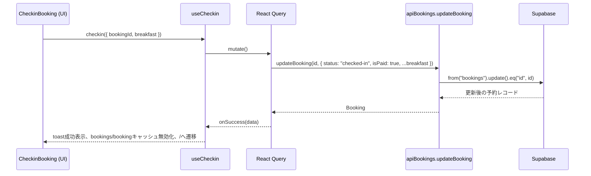
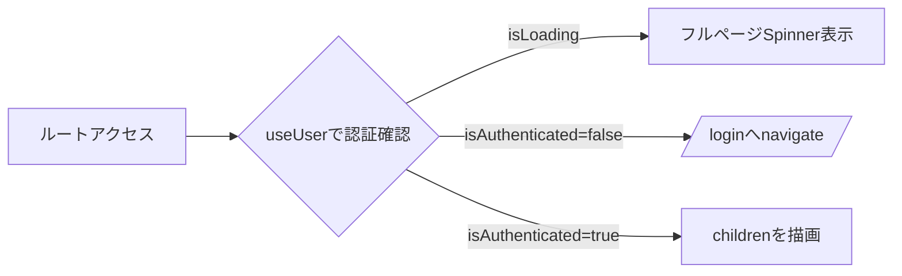

# The Wild Oasis 技術ドキュメント

作成日: 2026-09-18

## 00. 概要

### 背景・目的・ゴール

The Wild Oasis は、ホテル運営スタッフが客室・予約・ゲスト情報を一元的に管理するための内部業務ダッシュボードである。React 19 + Vite によるシングルページアプリケーション（SPA）として構築され、バックエンドには BaaS（Backend as a Service）である Supabase を採用し、自前の API サーバーを持たない構成となっている（`docs/spec.md` 非機能要件を参照）。

ゴールは、フロントデスク業務（チェックイン/チェックアウト、予約管理、客室管理）を単一の管理画面に集約し、リアルタイム性の高いデータ同期（React Query によるサーバー状態管理）と型安全性（TypeScript strict モード）を両立したアプリケーションを提供することである。

### ターゲットユーザーと提供価値

| 項目 | 内容 |
| --- | --- |
| 対象ユーザー | ホテルの内部スタッフ（フロントデスク担当者、管理者） |
| 対象外 | 宿泊客向けのゲストインターフェースは本アプリケーションのスコープ外である |
| アクセス制御 | Supabase Authentication による認証必須。新規スタッフアカウントは既存スタッフのみが作成可能（一般公開のサインアップ導線は持たない） |
| 提供価値 | 客室・予約・ゲスト管理の一元化、日次業務（チェックイン/チェックアウト）の効率化、売上・稼働率のダッシュボード可視化 |

> 本セクションは `docs/spec.md` および `docs/design.md` の記述をベースに要約したものであり、実装コード（`src/App.tsx`, `src/ui/ProtectedRoute.tsx` 等）で該当する認証ガード・ルーティング構成の存在を確認済みである。

## 01. 主な機能

各機能は `src/features/` 以下のモジュールに対応し、React Query の `useMutation` / `useQuery` をラップしたカスタムフックが UI と Supabase API 層（`src/services/`）を介在する。

### 機能一覧

| 機能 | 主要ファイル | 概要 |
| --- | --- | --- |
| 認証 | `useLogin`, `useSignup`, `useLogout`, `useUpdateUser`, `useUser` | Supabase Auth によるログイン/サインアップ（既存スタッフのみ）/ログアウト、パスワード・表示名・アバターの更新 |
| ダッシュボード | `useRecentBookings`, `useRecentStays`, `Stats`, `SalesChart`, `DurationChart` | URL クエリパラメータ `last`（7/30/90日）に応じて期間集計し、売上・稼働率・滞在日数分布を可視化 |
| 客室管理 | `useCabins`, `useCreateCabin`, `useEditCabin`, `useDeleteCabin` | 客室の一覧取得・作成・編集（画像アップロード含む）・削除。作成時は Supabase Storage への画像アップロードを伴う |
| 予約管理 | `useBookings`, `useBooking`, `useDeleteBooking` | フィルタ/ソート/ページネーション付き一覧、詳細取得、削除 |
| チェックイン/アウト | `useCheckin`, `useCheckout`, `useTodayActivity` | 支払い確認・朝食オプションを伴うチェックイン、チェックアウト、本日の入退室一覧ら|
| 設定 | `useSettings`, `useUpdateSetting` | 朝食仡格、最小/最大宿泊日数、最大ゲスト数の取得・更新 |

### 入出力・振る舞いの例

代表的なフックの入出力と副作用を以下に示す。
| フック | 入力 | 出力 | 主な遯作用 |
| --- | --- | --- | --- |
| `useCheckin` | `{ bookingId, breakfast? }` | `{ checkin, isCheckingIn }` | `status` を `checked-in`、`isPaid` を `true` に更新。成功時に、`bookings`/`booking` キャッシュを無効化し `/` へ遷移 |
| `useCheckout` | `bookingId: number` | `{ checkout, isCheckingOut }` | `status` を `checked-out` に更新。キャッシュ無効化のみ（遷移なし） |
| `useLogin` | `{ email, password }` | `{ login, isLoading }` | 成功時 `["user"]` キャッシュを更新し `/dashboard` へ遷移。失敗時はトースト表示のみ（メッセージは汎用化され、詳細は開発環境のみ console 出力） |
| `useUpdateSetting` | `SettingsUpdate`（部分更新） | `{ updateSetting, isUpdating }` | 成功時 `settings` クエリを無効化しトースト表示。設定は常に `id=1` の単一行 |
| `useRecentBookings` | URL クエリ `?last=` （未指定時 7） | `{ isLoading, bookings }` | 現在日から N 日前までの予約を取得しダッシュボードの売上集計に使用 |

> `useCheckin` / `useCheckout` はキャンセル・削除フローを持たず、ステータス遷移は一方向（unconfirmed → checked-in → checked-out）であることが `src/types/domain.ts` の `BookingStatus` 型から確認できる。

## 02. アーキテクチャ

### システム全体設計と責務分離

React SPA + Supabase BaaS の 2 層構成であり、自前 API サーバーは持たない。フロントエンド内部ではルーティング層、UH 層、サーバー状態層（React Query）、API 層（`src/services/`）に責務が分離されている。`ProtectedRoute`（`src/ui/ProtectedRoute.tsx`）が `useUser` を経由して認証状態を判定し、未認証の場合は `/login` へリダイレクトする（`src/App.tsx` のルート定義で確認済み）。

### 主要データフロー（予約チェックインの例）

`useCheckin`（`src/features/check-in-out/useCheckin.ts`）を例に、UIから Supabase までの一連の呼び出しを示す。

### 認証フロー（ProtectedRoute）

> 上記の Mermaid 図は `docs/design.md` のアーキテクチャ図をベースに、`src/App.tsx`、`src/ui/ProtectedRoute.tsx`、`src/features/check-in-out/useCheckin.ts`、`src/services/apiBookings.ts` の実コードと照合して作成した。

## 03. 構成と制約

### 技術スタック

| レイヤー | 技術 | バージョン |
| --- | --- | --- |
| 言語 | TypeScript（strictモード） | \~5.9 |
| UI | React | 19.2.7以上 |
| ルーティング | React Router | v8.3.0以上 |
| サーバー状態 | @tanstack/react-query | v5 |
| スタイリング | styled-components | v6 |
| フォーム | react-hook-form | v7 |
| BaaS | @supabase/supabase-js | ^2.106.2 |
| ビルド | Vite | 7 |
| 単体/結合テスト | Vitest + @testing-library/react | Vitest \~4.1.8 / RTL \~16.3.2 |
| E2Eテスト | Playwright | \~1.60.0 |
| パッケージマネージャー | bun（必須、npm/yarn/pnpm禁止） | >=1.0.0 |
| ランタイム要件 | Node.js | >=22.22.0（React Router v8互換要件） |

依存バージョンは `package.json`の実値を確認済み。`overrides` で rollup / minimatch / brace-expansion / postcss / undici（`>=7.24.0 <8`、jsdom@28互換のため固定）/ flatted / picomatch のバージョンを明示固定している。

### ディレクトリ構成

| パス | 役割 |
| --- | --- |
| `src/main.tsx` | エントリーポイント |
| `src/App.tsx` | ルート定義 + プロバイダー（QueryClientProvider、DarkModeProvider、Toaster） |
| `src/features/` | 機能モジュール（authentication, bookings, cabins, check-in-out, dashboard, settings） |
| `src/pages/` | ルートに対応するページコンポーネント |
| `src/ui/` | 写回し可能な共通UIコンポーネント（`.tsx`） |
| `src/services/` | Supabase API クライアント初期化設定 |
| `src/hooks/` | 汎用カスタムフック（`useLocalStorageState`, `useMoveBack`, `useOutsideClick`） |
| `src/context/` | Context API（`DarkModeContext`） |
| `src/types/` | `domain.ts`（ドメイン型）, `supabase.ts`（生成型）, `common.ts`（共通ユーティリティ型） |
| `src/utils/` | `constants.ts`, `helpers.ts` |
| `src/styles/` | `GlobalStyles.ts`（グローバルスタイル集約） |
| `src/test/` | Vitestセットアップ（`setup.ts`） |
| `e2e/` | Playwright シナリオ（`.spec.ts`）とシードスクリプト（`seed.ts`） |
| `docs/` | `spec.md`（仕様書）, `design.md`（技術設計書） |

各 `__tests__/` ディレクトリは対応するモジュール直下に配置されており（例：`src/services/__tests__/`, `src/features/*/__tests__/`）、テスト対象と実装が同一階層に隣接している。

### 技術的制約・環境制約

| 分類 | 制約内容 |
| --- | --- |
| パッケージマネージャー | `bun` 必須。`npm`/`yarn`/`pnpm` の使用禁止。スクリプト実行も `bun run` / `bunx` を使用 |
| リンタイム | Node.js 22.22.0以上（React Router v8 互換要件） |
| Supabase | テーブルスキーマを直接変更しない。RLS（Row Level Security）はSupabaseダッシュボード上で管理 |
| 秘密情報 | `.env` をコミットしない（`.gitignore` で `.env`, `.env.test`, `.env.local`, `.eslintcache` を除外済み） |
| E2Eシード | `e2e/seed.ts` の単独実行は `--force-seed` または `ALLOW_DESTRUCTIVE_SEED=1` が必須。非テスト環境（`.env.local`等）への接続には `ALLOW_NON_TEST_SEED=true` が必須 |
| Git履歴 | シークレット・絶対パス混入時も、ユーザーの事前合意なく `git filter-branch`/`filter-repo` を単独実行しない |
| React Queryキャッシュ | `staleTime` は原則 0（`src/App.tsx` で確認済み）。変更には正当理由・測定結果・オーナー明記が必要 |
| CI/サプライチェーン | GitHub Actions はコミットSHA固定（バージョンコメント付き）必須（`.claude/rules/01-engineering-standards.md`） |

依存関係として、React Router v8 の互換要件として React 19.2.7以上・Vite 7以上が必須であり、これらはパッケージアップグレード時の制約条件となる。

## 04. 品質と未検証の範囲

### テスト方針と現状の保証範囲

| レイヤー | ツール | 保証状況 |
| --- | --- | --- |
| 単体/結合テスト | Vitest + Testing Library（jsdom） | リポジトリ内に **71** 件の `*.test.ts(x)` が存在。`src/features/*` のカスタムフック/コンポーネント、`src/services/services.test.ts`、`src/types/domain.test.ts`、`src/hooks/*`、`src/utils/*` をカバー |
| E2Eテスト | Playwright | `e2e/` 以下に 8 本の `.spec.ts`（navigation, checkin, bookings, cabins, settings, dashboard, account, authentication）。`test:e2e` は `seed:e2e`（`--force-seed` 付与）を自動連鎖 |
| 型検査 | `tsc --noEmit` | `tsconfig.json` で `strict: true` 、`noUnusedLocals`/`noUnusedParameters` 有効 |
| Lint | ESLint | `--max-warnings 0` で警告も許容しない設定 |

### 未検証の範囲・エッジケース（コード調査に基づく事実）

| 領域 | 内容 |
| --- | --- |
| UIプリミティブの単体テスト未整備 | `src/ui/` のうち `Button`, `Heading`, `Input`, `Row`, `Form`, `FormRow`, `Spinner`, `Sidebar`, `Header`, `MainNav`, `AppLayout` 等 25 コンポーネントには対応する `__tests__` ファイルが存在しない（`ConfirmDelete`, `Modal`, `Menus`, `Pagination` 等のインタラクティブ系はテスト済み） |
| `apiBookings.ts` の一部関数未直接テスト | `src/services/__tests__/services.test.ts` は `getBooking` / `updateBooking` / `deleteBooking` のみをカバー。一覧取得の `getBookings`（filter method `gte`/`lte`/`neq`/`eq` 分岐とページネーション計算）、`getBookingsAfterDate`、`getStaysAfterDate`、`getStaysTodayActivity`（OR条件の組み立て）のサービス層単体テストは見当たらない。対応するフックテスト（`useBookings.test.ts` 等）で間接的にカバーされている可能性はあるが、Supabaseクエリ構築ロジック自体の検証は限定的 |
| RLS（Row Level Security）の検証 | RLS は Supabase ダッシュボード上で管理され、リポジトリ内に定義ファイルがないため、コードベースの直接検証は不可能（推測） |
| `updateCurrentUser` の部分失敗ロールバック | `src/services/apiAuth.ts` はアバター更新失敗時にアップロード済みファイルを `remove` でクリーンアップするが、その `remove` 自体が失敗した場合は `console.warn` のみで孤立ファイルがストレージに残る余地がある（`src/services/apiAuth.ts:141-148`） |
| ページネーションの境界値 | `getBookings` は `page` が整数かつ 1以上でなければ1にフォールバックする実装だが、対応する境界値テストの有無は未確認 |

> 本セクションの「未検証の範囲」は、リポジトリ内のファイル存在確認とテストファイルの対応関係の照合による推定であり、実際のカバレッジレポート（`bun run test:coverage`）の実行結果ではない。正確な数値はカバレッジ実行で確認することを推奨する。

## 05. 参照コード

| パス | 役割・主要ロジック |
| --- | --- |
| `src/main.tsx` | Reactアプリケーションのマウントエントリー |
| `src/App.tsx` | ルート定義、`QueryClient`（`staleTime: 0`）初期化、`ProtectedRoute` による認証ガード、`DarkModeProvider`/`Toaster` のマウント |
| `src/ui/ProtectedRoute.tsx` | `useUser` で認証状態を判定し、未認証時は `/login` にリダイレクト |
| `src/services/supabase.ts` | Supabaseクライアント初期化（`supabaseUrl` をエクスポートし他サービスがストレージURL構築に利用） |
| `src/services/apiAuth.ts` | `signup` / `login` / `getCurrentUser` / `logout` / `updateCurrentUser`（パスワード・表示名・アバター更新、失敗時のアバタークリーンアップを実装） |
| `src/services/apiBookings.ts` | `getBookings`（フィルタ/ソート/ページネーション）、`getBooking`、`getBookingsAfterDate`、`getStaysAfterDate`、`getStaysTodayActivity`（本日の入退室OR条件）、`updateBooking`、`deleteBooking` |
| `src/services/apiCabins.ts` | `getCabins`、`createEditCabin`（画像アップロードと失敗時ロールバック） |
| `src/services/apiSettings.ts` | `getSettings` / `updateSetting`（単一行 `id=1` を常に更新） |
| `src/types/domain.ts` | Supabase生成型（`Database`）から派生するドメイン型（`Cabin`, `Booking`, `Guest`, `Settings` 等）と JOIN 拡張型（`BookingWithSummary`, `BookingWithDetails` 等）、フォーム入力型 |
| `src/types/supabase.ts` | Supabaseテーブルスキーマの生成垚義 |
| `src/features/check-in-out/useCheckin.ts` / `useCheckout.ts` | 予約ステータス遷移（`checked-in`/`checked-out`）とキャッシュ無効化を担うミューセーションフック |
| `src/features/dashboard/useRecentBookings.ts` / `useRecentStays.ts` | URLクエリ `last` に基づく期間集計データ取得 |
| `src/context/DarkModeContext.tsx` | ダークモード/ライトモードの切替状態を Context で全体共有 |
| `src/styles/GlobalStyles.ts` | styled-components のグローバルスタイル定義の集約先 |
| `src/test/setup.ts` | Vitest（jsdom環境）のテスト初期化設定 |
| e2e/seed.ts` | E2E用シードデータ注入スクリプト。砺網全と実行防止のガード。`--force-seed`/`ALLOW_DESTRUCTIVE_SEED`）を実装 |
| `vite.config.ts` | Vite/Vitest統合設定。`environment: "jsdom"`、`e2e/**/*.spec.ts` を Vitest 対象から晌外 |
| `tsconfig.json` | TypeScript strict�設定（`strict`, `noUnusedLocals`, `noUnusedParameters` 等） |

> 上表は代表的なファイルの抵籋であり、全ファイルを網羅するものではない。各機能モジュールの完全な一覧は 03. 構成と制約のディレクトリ構成表、およびリポジトリの `src/features/` 以下を参照。
