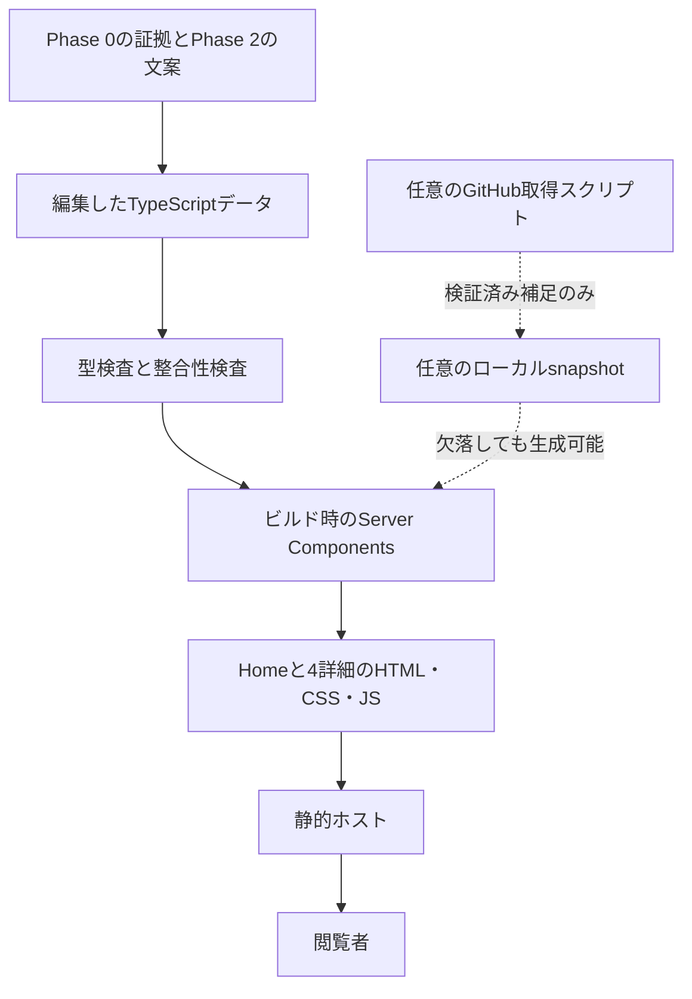

# PHASE 3 — Technical Architecture

## 0. 結論・対象・開始条件

**Next.js App Router・TypeScript・Tailwind CSSで、HomeとFeatured詳細4ページを静的生成する。掲載内容は手動編集するTypeScriptデータを正とし、GitHub APIを表示やビルドの必須条件にしない。** JavaScriptは学習一覧のアンカー移動と閲覧状態の復元に絞る。初期版ではshadcn/uiを導入せず、Phase 2で必要としたリンク・ラベル・開閉を小さな共通部品で実装する。

- 要件: [prompt.md](../prompt.md) のPHASE 3（3-1〜3-3）。今回の「PHASE 3の対応を進めて」を、Phase 2案に基づく開始承認として扱う。
- 継承: [Phase 1](phase-1-portfolio-strategy-and-information-architecture.md) の分類・詳細URLと、[Phase 2](phase-2-content-and-design-system.md) の文案・トークン・操作仕様。
- 掲載対象の事実: [Phase 0](phase-0-repository-evidence-audit.md) の2026-09-16 JST取得スナップショット。13リポジトリの再監査は行わない。
- 作業開始時の現状: このリポジトリには文書とルールファイルがあり、`package.json`・lockfile・アプリ実装・テスト基盤はまだない。本書の構成、型、コマンド、検証項目は**Phase 4向けの設計**であり、実装済み・実行済みの報告ではない。
- 選定先の公式資料は2026-09-16に確認した。採用する正確な依存バージョンはPhase 4開始時に互換性を確認してlockfileへ固定する。掲載対象アプリの依存バージョンを、このポートフォリオの依存として流用しない。

## 1. 技術選定と採用範囲

| 項目 | 決定 | 理由・範囲 |
|---|---|---|
| Next.js / App Router | 採用。`output: 'export'` | 4詳細の共通レイアウト、静的パラメータ、ページ別Metadataを一つの構成で管理する。Server Componentsはビルド時に実行し、配信時のNode.jsサーバーは不要とする |
| TypeScript | 採用。`strict`、`noUncheckedIndexedAccess`、`exactOptionalPropertyTypes` | 公開データの必須項目・種別・証拠参照の誤りを編集時に検出する |
| Tailwind CSS | v4系を採用候補としPhase 4で互換性を確定 | Phase 2のトークンとレスポンシブ配置を共通化する。CSSの`@theme`に色・書体・寸法を対応付ける |
| shadcn/ui | 初期版は不採用 | Phase 2にDialog・Drawer・複雑なフォームがない。既定の見た目と依存を追加する必要がなく、ネイティブHTMLで必要な操作を表現できる |
| Node.js / npm | ビルド・開発用に採用 | Phase 4でNext.jsの対応範囲内のLTS版を選び、ローカルとCIでそろえる。`package-lock.json`を管理し、CIは`npm ci`を使う |
| CMS / MDX / DB | 初期版は不採用 | 編集対象は13件と4詳細。構造化された静的データと共通記事テンプレートで足りる |
| 状態管理・取得ライブラリ | 初期版は不採用 | 検索・フィルタ・ログインがなく、開閉と閲覧状態だけをローカルに扱う |
| Zod | 初期版は不採用 | 静的データは型検査、任意の外部JSONは小さな型ガードで必要項目だけ検証する |
| テスト | Vitest・Playwrightを開発依存として計画 | データの整合条件と実ブラウザでのアンカー・戻る操作を分担する。React全体を単体テストに置き換えない |

Next.jsの静的出力では`generateStaticParams`による動的パスの列挙が必要で、ISR・Server Actions・標準の画像最適化サーバー等は使えない。本サイトは公開内容の更新を再ビルドで反映するため、この制約を受け入れる。[Next.js Static Exports](https://nextjs.org/docs/app/guides/static-exports)

Tailwindのテーマ変数はutility classの生成と対応付けるために使い、部品ごとに別の色を追加しない。shadcn/uiは必要なコンポーネントコードを取り込む方式だが、今回は取り込む必要がある部品がないという判断である。[Tailwind Theme variables](https://tailwindcss.com/docs/theme)、[shadcn/ui Introduction](https://ui.shadcn.com/docs)

HTML/CSSだけの構成や他の静的サイト生成も成立する。今回は推奨スタックと詳細ページの共通化を優先してNext.jsを選び、クライアントJSの費用はPhase 5で計測する。採用しただけで高性能とは表現しない。

## 2. 配信・ルーティング・責務

### 2.1 ページと出力

| パス（論理URL） | 内容 | 生成条件 |
|---|---|---|
| `/` | Phase 2のHome全セクション | 静的生成 |
| `/projects/multi-vendor-e-commerce` | R01詳細 | Featuredデータから生成 |
| `/projects/comparison-of-llms` | R06詳細 | Featuredデータから生成 |
| `/projects/medical-studies` | R12詳細 | Featuredデータから生成 |
| `/projects/the-wild-oasis-for-admin` | R02詳細 | Featuredデータから生成 |
| その他のパス | 404とHomeへのリンク | 未知slug・Secondary・Studiesの詳細を生成しない |

`app/projects/[slug]/page.tsx`の`generateStaticParams`はFeaturedだけを列挙する。`dynamicParams = false`とし、取得関数が不明なslugを受け取った場合も`notFound()`へ進む。Metadata、詳細リンク、sitemapも同じFeatured集合から生成し、別々の一覧を手入力しない。

配信の基本案は`trailingSlash: true`で各詳細をディレクトリの`index.html`として出力する方式。内部リンク・canonicalは同じURL生成関数で末尾スラッシュをそろえる。Phase 1・2の論理URLは維持し、`#quality`等のフラグメントは末尾スラッシュの後に付ける。静的ホストにはディレクトリindexと、未知パスへの実際のHTTP 404が必要。SPA用の全パス200フォールバックは設定しない。

初期の配信ベースはドメイン直下とする。ホスト・公開ドメインは未決定。サブパス配信が必要になった場合は、`basePath`、全リンク、アセット、canonicalを一緒に調整し、深いURLへの直接アクセスを検証する。

### 2.2 データの流れ



型や証拠参照に誤りがあればビルドを止める。任意のGitHub補足の欠落・失敗はビルドを止めない。この二つを同じfallbackで握り潰さない。

### 2.3 Server / Clientの境界

| 対象 | 実装境界 | 補足 |
|---|---|---|
| Layout、Navigation、Footer、Home各節 | Server Components | 本文・ナビ・GitHubリンクを最初のHTMLに含める |
| ProjectCard、StudyCard、DomainCard、Badge | Server Components | 公開用データだけを受け、監査全体をブラウザのpropsへ渡さない |
| Featured詳細と節ナビ | Server Components | 目次は描画する節から生成。現在節の追従ハイライトは初期版では実装しない |
| 開閉内容 | Serverで`details` / `summary`を出力 | JavaScriptなしでも手動で開閉できる |
| Home閲覧状態の制御 | 小さなClient Component | アンカー、開閉イベント、履歴復元だけを担当。カード本文はClient側からimportしない |

Client Componentには必要なIDだけを渡す。`window`、history、storageの読み書きはブラウザ側のeffect／イベント内に限定し、SSR時の初期値と初回描画を一致させる。Server Componentsを既定とし、ブラウザAPIが必要な部分に境界を置く方式に従う。[Next.js Server and Client Components](https://nextjs.org/docs/app/getting-started/server-and-client-components)

初期版のページ遷移は通常の`a`要素による文書ナビゲーションを基本とする。5ページの閲覧では、先読みやSPAの状態維持よりも、アンカー・ブラウザ履歴の挙動を明示できることを優先する。ルート全体を`use client`にしない。

## 3. Data Architecture（3-1）

### 3.1 Primary Source of Truthとファイルの役割

| 計画ファイル | 管理する情報 | 更新方針 |
|---|---|---|
| `data/site.ts` | 表示名、Hero、GitHubプロフィール、Philosophy、任意の連絡先 | Phase 2の文案を移す。実名・役職・メールを補わない |
| `data/projects.ts` | Featured4件とSecondary3件 | 技術・説明・見どころを証拠へ対応付ける |
| `data/studies.ts` | 学習6件 | 学習テーマと資料サイトの実装を分離する |
| `data/project-details.ts` | Featured4件のFeatures・Architecture・構成と制約・Quality | OverviewはProjectと共通化し、本文の重複更新を避ける |
| `data/domains.ts` | BUILD / STUDY / ENGINEER、領域リンク | 既存IDへの参照を持ち、カード本体を複製しない |
| `data/evidence.ts` | 公開する主張の根拠、情報源分類、確認日、固定SHA・ファイルURL | Phase 0の必要な証拠を明示的に移す。全監査を自動公開しない |
| `data/limitations.ts` | 掲載内容に関係する未検証範囲と監査状態 | 肯定的な技術事実の集合から分離する |
| `data/github.snapshot.json` | 任意のAPI補足 | 初期版には不要。導入時も編集データを上書きしない |

公開用テキストはReactが通常の文字列として描画する。リポジトリのREADME HTMLをそのまま取り込まず、任意のHTMLを許す汎用CMS・`dangerouslySetInnerHTML`も作らない。

### 3.2 全13件の所属・順序・アンカー

| ID | Repository | 保存先 / 種別 | 群内order | Homeアンカー | 詳細slug |
|---|---|---|---|---|---|
| R01 | Multi-Vendor-E-Commerce | projects / featured | 1 | `work-r01` | `multi-vendor-e-commerce` |
| R06 | Comparison-of-LLMs | projects / featured | 2 | `work-r06` | `comparison-of-llms` |
| R12 | Medical-Studies | projects / featured | 3 | `work-r12` | `medical-studies` |
| R02 | The-Wild-Oasis-For-Admin | projects / featured | 4 | `work-r02` | `the-wild-oasis-for-admin` |
| R08 | Software-Design-and-Architecture | studies | 1 | `study-r08` | — |
| R07 | Quality-Assurance-Studies | studies | 2 | `study-r07` | — |
| R11 | Security_Studies | studies | 3 | `study-r11` | — |
| R10 | Cloud-Infrastructure-and-Network-Studies | studies | 4 | `study-r10` | — |
| R13 | Algorithm-DataStructures-Math-SQL | studies | 5 | `study-r13` | — |
| R09 | Management-Team-Building-Studies | studies | 6 | `study-r09` | — |
| R04 | AirbnbCloneApp | projects / secondary | 1 | `work-r04` | — |
| R03 | The-Wild-Oasis-For-User | projects / secondary | 2 | `work-r03` | — |
| R05 | Next-Store | projects / secondary | 3 | `work-r05` | — |

R06・R12は元リストの「Studies」という分類からページ種別を推定せず、Phase 1のFeatured扱いを採る。`order`はFeatured・Secondary・Studiesの各群内で評価する。Starsや更新日で掲載順を自動変更しない。

### 3.3 証拠の表現と掲載ルール

公開する技術説明・技術ラベル・見どころは、空でない証拠IDの配列を持つ。各IDは`data/evidence.ts`の既存キーだけを参照する。型は「根拠が実在する」という参照を補助するもので、根拠が文章を裏付けるかは編集レビューで確認する。

| 情報 | 保存・公開の扱い |
|---|---|
| `REPOSITORY_VERIFIED / VERIFIED` | repoId、Phase 0の証拠ID、確認日、完全SHA、固定ファイルURLを記録。公開時は文章の近くに意味のあるソースリンク |
| `USER_PROVIDED / VERIFIED` | 提供内容と文書内の出典位置を記録。Philosophy等に使用。privateな提供情報をそのまま公開しない |
| `INFERRED / UNVERIFIED` | 公開用Claimの参照先へ入れない。推測をVerifiedへ変換しない |
| `NOT_FOUND` | 調査範囲では見つからなかったと記録。「存在しない」と断定しない |
| `NOT_VERIFIED` | 未検証の範囲として記録。「設定あり」と「成功確認済み」を分ける |
| `NOT_APPLICABLE` | 監査対象外として記録。対象アプリに機能がないという意味にしない |
| `INSPECTION_UNAVAILABLE` | 取得不可として記録。情報の不在と区別し、提供証拠があればその範囲を使う |

Missing Informationは`limitations`として保持する。詳細ではPhase 2の文案に必要な制約のみ文章で示し、内部ステータスや監査表をHomeへ流し込まない。Secondary・Studyの補足にも制約が必要な場合は、同じrepoIdの制約から掲載対象を選ぶ。たとえばR12は公開時制限の確認済み事実と、臨床的有効性が監査対象外であることを別々に扱う。[R12-F03](phase-0-repository-evidence-audit.md#r12-f03)、[Phase 0のR12](phase-0-repository-evidence-audit.md)

`checkedAt`は参照コードの確認日、`fetchedAt`はAPI補足の取得時刻、サイト更新日は文案の更新日として区別する。再ビルドした日やAPIの`updated_at`で証拠の確認日を更新しない。

### 3.4 編集フロー

1. Phase 0の証拠ID・対象SHA・制約を確認し、公開する文をPhase 2と照合する。
2. 必要な証拠を登録し、Project／Study／詳細本文から参照する。
3. 型検査とデータの整合性検査を行い、プレビューで文意・順序・リンク先を確認する。
4. 変更したデータと対応する証拠をレビュー可能な差分にする。更新内容を静的ビルドへ反映する。

技術情報を新しく追加するときは証拠も更新する。GitHubの最新READMEに表現が増えただけでは、実装確認済みの主張を追加しない。

## 4. Type Safety / Project Model（3-2・3-3）

### 4.1 型の契約案

以下は設計用の型抜粋。実際の13件データや実行コードはPhase 4で作る。`E`は検証済み証拠レジストリの`keyof typeof evidence`、`L`は制約レジストリのキーを渡す。`Record<string, ...>`への広い型注釈でキーを失わず、レジストリ自体も`as const satisfies ...`で宣言する。

```typescript
type RepositoryId =
  | 'R01' | 'R02' | 'R03' | 'R04' | 'R05' | 'R06' | 'R07'
  | 'R08' | 'R09' | 'R10' | 'R11' | 'R12' | 'R13';

type NonEmpty<T> = readonly [T, ...T[]];
type HttpsUrl = `https://${string}`;

type VerifiedEvidence =
  | {
      sourceType: 'REPOSITORY_VERIFIED';
      status: 'VERIFIED';
      repoId: RepositoryId;
      auditId: string;
      checkedAt: string;
      commit: string;
      sources: NonEmpty<{ label: string; url: HttpsUrl }>;
    }
  | {
      sourceType: 'USER_PROVIDED';
      status: 'VERIFIED';
      sourceLocation: string;
      checkedAt: string;
    };

type Limitation = {
  repoId: RepositoryId;
  auditId: string;
  status:
    | 'NOT_FOUND' | 'NOT_VERIFIED'
    | 'NOT_APPLICABLE' | 'INSPECTION_UNAVAILABLE';
  sourceType:
    | 'USER_PROVIDED' | 'REPOSITORY_VERIFIED'
    | 'INFERRED' | 'UNVERIFIED';
  text: string;
};

type Claim<E extends string> = {
  text: string;
  evidenceIds: NonEmpty<E>;
};

type EntryBase<E extends string> = {
  id: RepositoryId;
  name: string;                       // 正確なRepository名
  title: string;                      // Phase 2の用途・題材見出し
  description: Claim<E>;
  githubUrl: `https://github.com/myoshi2891/${string}`;
  order: number;
};

type Project<E extends string> = EntryBase<E> & {
  technologies: readonly Claim<E>[];
  highlights: readonly Claim<E>[];
} & (
  | { type: 'featured'; slug: string }
  | { type: 'secondary'; slug?: never }
);

type Study<E extends string> = EntryBase<E> & {
  type: 'study';
  topics: NonEmpty<string>;
  implementationNotes: readonly Claim<E>[];
};

type DetailSectionId = 'features' | 'architecture' | 'decisions' | 'quality';

type ProjectDetail<E extends string, L extends string> = {
  sections: Record<DetailSectionId, {
    claims: readonly Claim<E>[];
    limitationIds: readonly L[];
  }>;
  scope?: NonEmpty<Claim<E>>;
};
```

実装時のデータ宣言は`as const satisfies readonly Project<EvidenceId>[]`、`as const satisfies readonly Study<EvidenceId>[]`とする。Featuredのリテラルslugから`FeaturedSlug`を導出し、詳細を`satisfies Record<FeaturedSlug, ProjectDetail<EvidenceId, LimitationId>>`で検査する。`scope`の証拠は本人提供であることを整合性検査でも確認する。

`satisfies`は式の具体的な推論型を維持しながら型への適合を確認できるが、文字列の内容の真偽や外部JSONの安全性を検証するものではない。[TypeScript satisfies](https://www.typescriptlang.org/docs/handbook/release-notes/typescript-4-9.html)

### 4.2 フィールドの採否

| 候補 | 判断 |
|---|---|
| `slug` | Featuredのみ必須。URLを持たない9件には不要 |
| `name` / `title` | 両方採用。Repository名と用途見出しを分離 |
| `type` / `featured` | `type`を判別子に採用。`featured`真偽値は`type === 'featured'`から導出し二重管理しない |
| `description` / `technologies` / `highlights` | 採用。技術的説明はClaimとして証拠に接続。Homeの技術ラベルは編集順の先頭3件 |
| `githubUrl` | 採用。許可された所有者・Repository名との一致を検査する |
| `status` | Project全体には設けない。本番・開発中等は未確認であり、検証状態は証拠単位に置く |
| `order` | 採用。群内の掲載順であり能力順位ではない |
| `id` | 採用。Phase 0とHomeアンカーの安定した接続に使う |
| `topics` / `implementationNotes` | Study専用。題材と実装技術を分離 |
| `demoUrl` / `image` / `metrics` | 初期モデルから省略。提供・検証後に必要なものだけ追加 |

Overviewは共通のProject、`#evidence`は参照された証拠の集合から作る。`#scope`は値がある場合だけ節と目次に追加する。`#decisions`の公開見出しは「構成と制約」。本人の採用理由を生成するフィールドは用意しない。

### 4.3 型で検査する範囲と実行時境界

| 層 | 検証内容 |
|---|---|
| TypeScript | 必須項目、種別、Featuredだけのslug、空でない証拠参照、存在する証拠ID・詳細キー |
| ローカルデータの整合性検査 | 13件の重複・欠落、4/6/3分類、群内order・slug・アンカーの一意性、詳細の過不足、空文字、URL所有者・repo一致、日付・SHA形式、証拠の対象repo一致、Scopeの本人提供根拠 |
| 外部入力の実行時検証 | 任意のGitHub JSON、保存した閲覧状態、公開URLの環境設定。`unknown`から必要な値だけ取り出す |
| 編集レビュー | 文章を証拠が裏付けるか、学習題材と実務経験を混同していないか、未検証の成功を主張していないか |

静的データをブラウザで毎回Zodに通さない。整合性検査もビルド前の純粋な検査として実行し、画面表示に監査エンジンを持ち込まない。

## 5. GitHub API — Optional Enrichment

**初期リリースはGitHub APIなしで完成させる。** Stars等は採用判断に必要な情報ではなく、Phase 2の表示内容にもない。将来追加する場合は、独立した手動更新スクリプトが取得したsnapshotを読む方式とし、通常の`build`や閲覧時にはGitHubへ問い合わせない。

| 候補 | 利用方針 |
|---|---|
| Stars / Forks | 必要になった場合のみ数値と取得日時を補足表示。掲載順や実装品質の根拠にしない |
| Languages | 初期の取得対象外。追加する場合もAPI集計として隔離し、`technologies`・スキル・学習テーマを上書きしない |
| Updated date | 必要なら「GitHub情報の更新日時」と明示。コード更新・デプロイ・証拠確認の日時に読み替えない |

リポジトリ取得APIの返却フィールドを選択して利用する。[GitHub REST: Get a repository](https://docs.github.com/en/rest/repos/repos#get-a-repository)

将来のsnapshotは`schemaVersion`、`repoId`、`fetchedAt`、`stars`、`forks`、`githubUpdatedAt`だけを保持する。生レスポンスやトークンを保存しない。URLは編集データから構成した許可済み13件だけに限定し、JSONの`full_name`が期待するrepoと一致するか、数値が非負整数か、日時が妥当かを検査する。

snapshotは静的なJSON importにせず、ビルド時の専用loaderがファイル読み取り・`JSON.parse`・型ガードを例外処理付きで行う。ファイル欠落や構文破損がモジュール解決エラーにならない構成にする。未来の取得日時や未対応の`schemaVersion`も不採用とする。

| 状況 | 振る舞い |
|---|---|
| 未導入・snapshotなし | 補足なしで通常表示・build成功 |
| timeout・DNS失敗・403・429・404・5xx | 更新スクリプトは失敗をログに残し、前回の有効なレコードを維持。サイトは通常表示 |
| 一部repoだけ失敗 | 成功したレコードだけ更新し、失敗したものの`fetchedAt`を進めない |
| JSON破損・型不正・repo不一致 | 該当レコードを不採用。snapshot全体が壊れていれば補足全体を省略 |
| 取得から7日超（設計上の表示期限） | 数値を省略。0として扱わない。時間の判定はビルド時なので、公開中の値には取得日も必ず添える |

1リクエスト5秒、同時実行2件まで、1回の更新全体60秒を上限とする設計。自動再試行・常駐cronは初期導入しない。更新スクリプトの失敗と通常のサイトbuildを分離し、書き換えは一時ファイルを検証してから置換する。

認証を使う場合の`GITHUB_TOKEN`は更新処理の環境だけで参照する。`NEXT_PUBLIC_`変数、Client Component、生成物、ログへ渡さない。PRや通常ビルドでトークンを必要としない。

## 6. 開閉・アンカー・戻る操作

### 6.1 ネイティブ開閉を土台にする

基本3件は常に表示し、追加3件は一つの`details`に置く。カードの補足も独立した`details`とする。`summary`内にリンクやボタンを入れず、開閉状態の通知はネイティブ要素に任せる。`details`は開閉を表す標準要素である。[HTML Standard: details](https://html.spec.whatwg.org/multipage/interactive-elements.html#the-details-element)

一覧の文言は閉状態「すべての学習を見る（残り3件）」、開状態「追加の3件を閉じる」。`[open]`に対応したCSSで片方だけを表示し、読み上げ名も一致させる。JSなしでも文言が切り替わる。本文・追加3件ともHTMLに含め、取得待ちにはしない。

### 6.2 アンカー移動

Home用の小さな制御部品で、既知のHomeアンカーだけを処理する。フラグメントをそのままCSSセレクタへ連結せず、定義済みIDと`getElementById`で対象を解決する。

| 操作 | 挙動 |
|---|---|
| Home内で領域リンクをクリック | 対象の祖先`details`を開き、レイアウト反映後に移動。対象見出しを`tabIndex=-1`でプログラム的にフォーカスし、URLのhashを更新 |
| 詳細からHomeアンカーへ移動 | 通常リンクでHomeを読み込み、対象を開いて移動。初回読み込み扱いとしてフォーカスを奪わない |
| 共有URLを直接開く | hashが追加3件内なら一覧を開いて移動。フォーカスの強制移動はしない |
| 同じhashのリンクを再クリック | URLが変わらなくても、対象を開いて再度移動できる |
| 不明なhash | エラーにせず通常のページを表示 |
| JSなし | 手動展開で全6件とGitHubリンクへ到達可能。閉じた内容への自動展開はブラウザ差に依存するため合格条件にしない |

通常クリックだけを補助し、修飾キー・別タブ操作を妨げない。展開とスクロールは即時とし、フォーカスには`preventScroll`を使って二重の移動を防ぐ。

### 6.3 履歴と状態の復元

復元対象はHomeの開いている`details`のID、スクロール位置、必要な場合の復帰先要素ID。個人情報や入力データは保存しない。

1. 各履歴エントリに識別子を持たせ、`history.state`の専用キーへ版番号と状態を保存する。既存のstateキーは上書きしない。
2. 同一ページのアンカー移動前に現在の状態を保存してから履歴を追加する。開閉は履歴を増やさず現在エントリの状態を更新する。
3. スクロールは間引いて保存し、ページを離れるリンク操作・`pagehide`でも保存する。`sessionStorage`へ識別子単位の補助コピーを置く場合も、小さな上限（直近20件）を設ける。
4. `pageshow`／戻る・進むの`popstate`で状態を読む。BFCacheが復元したDOMは維持し、再初期化で一覧を閉じない。
5. BFCacheを使わない戻る操作では、開閉を先に復元し、レイアウトが成立してから保存位置へ移動する。戻る・進むでは保存状態を優先し、新規の共有URLではhashを優先する。
6. JSで位置復元を担当する間は`history.scrollRestoration = 'manual'`とし、ブラウザの自動復元と競合させない。フォントによる高さの変化が残る場合は読み込み後に位置を一度補正し、ユーザーが既に操作した場合は補正を取り消す。

閉じる操作はsummaryにフォーカスを残す。内部にフォーカスがある状態をプログラムで閉じる必要がある場合は先にsummaryへ戻す。履歴復元では新規アクセスと区別し、保存されたフォーカス対象が存在・可視の場合だけ復帰する。

storage拒否・壊れた保存値は読み取り境界で無視し、同一タブの`history.state`とネイティブ表示へ退避する。保存機能が使えなくても手動展開・リンク操作を維持する。復元の正確性は設計段階では保証済みとせず、BFCache有無を含むChromium・Firefox・WebKitのE2Eで合否判定する。

## 7. デザイン仕様の実装への対応

### 7.1 トークンとコンポーネント

Phase 2の色・書体・余白・角丸を`app/globals.css`に一度だけ定義し、Tailwindのutilityへ対応付ける。S／M／Lは768px・1200pxを境界にする。Tailwind既定の`lg`を1200pxと読み替えず、使用するブレークポイントを明示的に定義する。

最大内容幅1200px、本文42rem、ナビは通常フロー、独立操作の領域は44px以上を継承する。Disclosure・ActionLink・SectionHeader等を小さく共通化し、全てを扱える汎用カードやvariant生成ライブラリは導入しない。

### 7.2 フォント

Inter＋Noto Sans JP、400／500／600を継承し、Phase 4でライセンスと配布元を確認したWOFF2をローカル管理する。ビルド時・閲覧時のGoogle Fontsへの問い合わせを必須にしない。

Interは`next/font/local`でCSS変数へ接続する案とする。Noto Sans JPは日本語グリフを多数含むため、正規配布の分割WOFF2と`unicode-range`を持つローカル`@font-face`を基本案とし、全分割ファイルのpreloadを避ける。独自の文字抜き出しによるサブセット生成は初期版では追加しない。取得元・ライセンス・使うファイル一覧を資産と一緒に記録する。

`font-display: swap`とPhase 2のフォールバックを用い、ロード失敗でも文字を表示する。フォント配信量とレイアウト変化は実測し、容量が大きい場合はファイル構成を見直す。ローカルフォントの読み込み機構はNext.js公式に沿う。[Next.js Font Optimization](https://nextjs.org/docs/app/getting-started/fonts)

### 7.3 画像・図

初期本文は画像なしで成立させる。必要な矢印等は小さなSVGまたはCSSで作り、アイコンライブラリを追加しない。実装構成図を置く場合は確認済み経路だけを静的SVG／HTMLとして表し、説明文を添える。ブラウザでMermaidを動かす依存は不要とする。

将来スクリーンショットを追加する場合は出典・利用可否を確認し、ビルド前に適切なサイズへ変換した画像にwidth・height・altを付ける。static exportで標準の画像最適化サーバーを使う設定は選ばない。OG画像は別用途として、Phase 4で文字中心の静的画像を作る。

## 8. SEO・配信設定・空状態

| 項目 | 方針 |
|---|---|
| Metadata | `lang="ja"`、Homeのtitle・description、Projectデータ由来の詳細title・description。証拠がない肩書き・実績を加えない |
| Open Graph | サイト名・ページ名・日本語要約、ローカルの静的OG画像を使用。実アプリ画像と誤認させない |
| canonical / sitemap | 実際の公開ベースURLを設定してHome＋4詳細だけを列挙。アンカー・架空の詳細を含めない |
| robots | 公開環境は意図したインデックス設定、プレビューはnoindex。公開URL未設定時はcanonicalとrobotsのsitemap指定を省略し、sitemapは空のURL集合を返す |
| 更新日 | 根拠のある編集更新日がなければsitemapの`lastModified`を省略。build日時やAPI更新日を代入しない |
| Contact | 連絡先がなければGitHubへの末尾導線だけ。ナビのContactとフォームは出さない |
| Scope / Demo / 画像 | データ未提供なら節・CTA・枠ごと省略。未完了のリンクを置かない |
| 404 | Home・代表作への入口を表示。ホストの404設定も検証する |

`SITE_URL`（公開ベースURL）と`DEPLOYMENT_ENV`（preview / production）のみをサイト側の環境設定として計画する。通常のローカル開発・preview buildはURL未設定でも成立させる。production buildは実在の配信先として指定されたHTTPS URLがない場合に停止し、架空URLを公開しない。これは公開設定の不足でありGitHub API障害とは別に扱う。

ホストを選定した後、HTTPS、Content-Type、404、キャッシュ、必要なセキュリティヘッダーを配信側に設定する。static exportではNext.jsサーバーのheaders設定に依存しない。CSPを設定する場合も生成HTMLのscriptと整合するかを実出力で確認し、本文や開閉が壊れるポリシーを推測で入れない。

## 9. Phase 4のディレクトリ案

以下は**作成予定**。本Phaseではアプリファイルや依存を作成しない。

```text
app/
  layout.tsx
  page.tsx
  globals.css
  not-found.tsx
  projects/[slug]/page.tsx
  sitemap.ts
  robots.ts
components/
  layout/                  Navigation、Footer
  home/                    各節、Homeの状態制御
  projects/                ProjectCard、詳細記事、DetailContents
  studies/                 StudyCard
  ui/                      ActionLink、Badge、SectionHeader、Disclosure
data/
  site.ts
  projects.ts
  studies.ts
  project-details.ts
  domains.ts
  evidence.ts
  limitations.ts
types/
  portfolio.ts
lib/
  portfolio.ts             取得・並べ替え・公開用データへの変換
  routes.ts                URL・アンカー生成
  validate-content.ts      データ整合性検査
  navigation-state.ts      閲覧状態の検証・保存
public/
  fonts/                   日本語フォントとライセンス
  og/                      静的OG画像
assets/fonts/              next/font/local用フォントとライセンス
__tests__/
  content.test.ts
  navigation-state.test.ts
e2e/
  portfolio.spec.ts
docs/
  phase-0-repository-evidence-audit.md
  phase-1-portfolio-strategy-and-information-architecture.md
  phase-2-content-and-design-system.md
  phase-3-technical-architecture.md
next.config.ts
tsconfig.json
package.json
package-lock.json
```

型定義はデータをruntime importしない。データ → 純粋な取得・変換 → ページの一方向を保ち、コンポーネントからデータを書き換えない。Optional Enrichmentのスクリプト・snapshotは導入を決めた時点でだけ追加する。

## 10. 実装順・検証・完了条件

### 10.1 実装順

Phase 4開始後に依存・実行基盤を確定し、次のまとまりで実装する。コード実装では[既存TDDワークフロー](../.claude/rules/tdd-commit-workflow.md)に従い、失敗テストの確認・コミット、最小実装・成功、整理・仕様同期を分ける。既存のユーザー変更を一括コミットに含めない。

1. データ型と証拠・13件の編集データ。分類、slug、証拠参照の整合条件を検査する。
2. 静的生成と共通レイアウト、Home、Featured詳細4件、404。
3. デザイントークン、ローカルフォント、ネイティブ開閉、状態復元。
4. Metadata・OG・sitemap・robots、公開設定と静的配信の確認。
5. Phase 5で視覚・UX・アクセシビリティ・性能を実測し、結果と未検証範囲を記録する。

### 10.2 計画するコマンドと検証範囲

現在は`package.json`がないため以下は未作成。Phase 4でセットアップ手順とともにREADMEへ記載する。

| 計画コマンド | 内容 |
|---|---|
| `npm run dev` | 開発サーバー |
| `npm run typecheck` | `tsc --noEmit` |
| `npm run lint` | ESLint CLI。buildと分けて実行 |
| `npm test` | Vitestによるデータ整合性・閲覧状態の境界検査 |
| `npm run build` | データ整合性検査に成功してから`next build`、`out/`生成 |
| `npm run preview` | `out/`を配信。`next start`をstatic exportの確認に使わない |
| `npm run test:e2e` | 静的出力に対するPlaywright。開発サーバーだけで合否判定しない |

CIは`npm ci` → 型・lint・単体検査 → build → 静的出力E2Eを基本とする。GitHub補足の更新はこの必須経路に含めない。初期版のビルドは依存導入後、ローカル資産と編集データだけで成立させる。

### 10.3 振る舞いの受け入れ条件

| 対象 | 合格条件 |
|---|---|
| 内容 | 13件が一度ずつ主掲載され、Featured4・Study6・Secondary3、順序は§3.2と一致 |
| 証拠 | 全ての技術的Claimに既存の公開可能な証拠。未検証の実績・Demoを表示しない |
| ルート | Home＋4詳細を直接開ける。未知slug、Study・Secondaryの詳細はHTTP 404 |
| アンカー | Homeの全導線、4詳細の節、`comparison-of-llms#quality`相当の導線が実在。非表示Scopeへ目次を出さない |
| 開閉 | 追加3件へ共有URL・領域リンクから移動できる。同じhashの再選択でも開ける |
| 履歴 | 開閉→スクロール→詳細→戻る、アンカー間の戻る／進む、再読込、BFCache有無で§6の優先順を満たす |
| 障害 | JS無効でも全内容へ到達可能。storage拒否でも通常操作可能。GitHub通信を遮断しても表示・buildが成立 |
| Optional Enrichment導入時 | timeout・rate limit・不正JSON・欠落・古い値を再現し、基本コンテンツと掲載順を維持 |
| アクセシビリティ | キーボード、skip link、見出し、44px目標領域、focus-visible、コントラスト、reduced motionを確認 |
| レスポンシブ | 320・768・1200・1440px程度、200%文字拡大、長いRepository名、フォント未読込で欠け・ページ横スクロールなし |
| SEO・配信 | 実URLに基づくMetadata・OG・sitemap・robots、previewのnoindex、静的ホストの404を確認 |
| 性能 | JS・フォント容量、LCP・CLS、操作時の反応を測定。Lighthouseやラボ値を実利用のINP・実績と混同しない |

### 10.4 本Phaseの完了確認

- [x] 推奨技術の採否と、静的出力の制約を記載した。
- [x] 3-1: 編集データをPrimary Source of Truthとし、GitHub障害から独立する構成を定義した。
- [x] 3-2: TypeScript・`satisfies`と、外部入力の実行時検証の境界を定義した。
- [x] 3-3: Project／Study／詳細／証拠の型契約と、採用しないフィールドの理由を定義した。
- [x] Phase 1・2の13件分類、4詳細、アンカー、条件付き表示を継承した。
- [x] Server／Client境界、開閉・履歴復元、フォント配信、SEO・配信条件を具体化した。
- [x] Phase 4の実装順・検証範囲・未決事項を整理した。

未決事項は、依存の正確なバージョン、フォント資産の取得・容量確認、実際のホストと公開URL。表示名・連絡先等の未提供情報はPhase 2の省略・暫定表示で実装を進められる。公開先が未定でもローカル・previewの実装は進められる。

本Phaseは設計文書の作成と整合性確認であり、アプリの型検査・build・テストやブラウザ検証を実施したことを意味しない。

文書の静的確認では、ローカル参照8件のリンク先、証拠アンカーの存在、対象13件と4/6/3分類、群内順序、Phase 2のRepository名・Homeアンカー・4詳細slugとの一致、3-1〜3-3の記載、コードフェンスの対応、ローカル絶対パスの不在を機械照合した。

**PHASE 3の設計案作成は完了。** レビュー対象は技術選定、データと証拠の型契約、APIを初期版に含めない方針、静的配信と閲覧状態の復元方針。[prompt.md](../prompt.md) のPHASE 4開始条件「Phase 3承認後に開始してください」に従い、実装は本設計の承認後に開始する。
